# TP1 - Services Web REST et SOAP avec Talend


## Télécharger PDF
[](tp1.pdf)

## Objectifs du TP
Création et consommation de web services SOAP et REST en utilisant l'outil Talend.

## Outils et Versions
* [Talend Open Studio for ESB](https://www.talend.com/download_page_type/talend-open-studio/) Version: 7.2
* [Java](http://www.oracle.com/technetwork/java/javase/downloads/index-jsp-138363.html) Version 1.8
* [MySQL](https://dev.mysql.com/downloads/) Version 5.7
* [SOAPUI](https://www.soapui.org/downloads/soapui.html) Version 5.3

## Talend ESB
Talend ESB est une solution légère, robuste et modulaire pour la création de services
web sécurisés ainsi que pour l’intégration d’applications nouvelles ou existantes.
Talend participe au développement des composants ESB à travers la communauté
Apache. Il collabore avec un grand nombre de développeurs de la communauté Apache
et a fait plusieurs contributions aux projets Apache.
Talend fournit:

* Un courtier de messages à haute performance.
* Des options de déploiement flexibles
* Des outils de développement pour Eclipse
* Une interface utilisateur pour l’intégration et la médiation d’applications
* Support pour les services web SOAP et REST
* La médiation et le routage
* Support pour le failover, le monitoring et la sécurité


L’environnement d’exécution standard de Talend ESB est un conteneur OSGi.
L’implémentation OSGi fournie avec Talend ESB est Apache Karaf, avec Eclipse Equinox
comme environnement d’exécution OSGi. Elle fournit un conteneur léger dans lequel les
différents composants et applications peuvent être déployées.

## Talend Open Studio for ESB
Talend Open Studio for ESB (TOS-ESB) fournit une interface graphique de
développement pour implémenter, compiler, tester et publier des services Web Java, des
applications REST, des services de données et des routes de messages.
Le déploiement d’applications avec TOS-ESB utilise principalement les trois blocs
représentés dans cette figure:


* Le bloc bleu représente l’API Talend Studio, où il est possible d’intégrer des
données, des services ou des applications
* Les blocs rouges représentent un ou plusieurs environnements d’exécution Talend
déployés dans votre système d’information. Il vous permet de déployer et
d’exécuter les Jobs, les routes et les services créés dans Talend Studio. Il est
possible d’avoir plusieurs environnements d’exécution, entre lesquels vous pouvez
basculer grâce à Talend Service Locator.
* Le bloc orange est une base de données de monitoring, permettant de stocker les
informations d’exécution des processus et de l’activité des services.

L’interface utilisateur de TOS-ESB se présente comme suit:

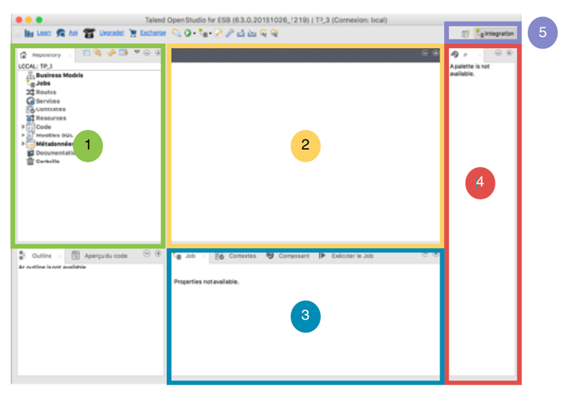


|Composant|Fonctionnalité|
|---------|-------------------------------------------------------------|
|  | Le traditionnel *Repository* contenant vos Jobs, services, fichiers, routes…   |
|  | La fenêtre principale, représentant graphiquement la composition de vos jobs et routes  |
|  | La fenêtre contenant les propriétés, la console d’exécution…  |
|  | La palette des composants à utiliser  |
|  | Les onglets pour le choix de la perspective à utiliser |


## Service Web SOAP : Helloworld
Nous ne pouvons pas configurer un ESB avant de savoir créer, déployer et exécuter des
services web avec les outils Talend ESB. Nous allons donc commencer avec le
traditionnel Hello World. Pour cela, il faut commencer par créer un projet de votre choix.
Dans toute cette partie, nous nous trouverons dans la perspective Integration.

### Créer le service SOAP

Pour créer un nouveau service de type SOAP:

* Clic-droit sur *Services* de votre Repository, et choisir *Create Service*. Appeler le
service *HelloWorldService*. Cliquer sur Suivant.
* On vous propose soit de créer un nouveau WSDL, soit de choisir un WSDL existant. Dans notre cas, nous créons un nouveau WSDL. Cliquer sur Terminer.
* Un service simple qui reçoit une chaîne de caractères et en produit une autre est
créé. Une vue graphique de son WSDL s’affiche.

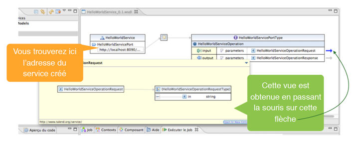

### Configurer le service SOAP

Pour pouvoir configurer votre service, il faut créer un Job. Mais d’abord:

* Importer le WSDL de votre service dans votre repository. Pour cela, clic droit sur
*HelloWorldService*, et choisir *Importer les schémas WSDL*. Vous retrouverez votre
WSDL dans la partie *Metadonnées -> Fichier XML*.
* Créer un nouveau Job pour votre service. Pour cela, clic-droit sur l’opération *HelloWorldServiceOperation* (sous Services) et choisir *Assign Job*.
* Modifier votre Job pour qu’il ait l’allure suivante (Le *tLogRow* nous permettra
d’afficher le résultat du service exécuté sur la console avant de l’envoyer au
consommateur):

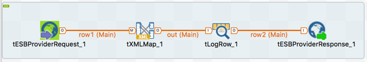

!!! tip "Astuce"

    Il est conseillé de relier d'abord les composants *tXMLMap* et *tESBProviderResponse_1*, puis d'insérer le *tLogRow*. On vous demandera en reliant les deux premiers composants : *Récupérer le schéma du composant cible?*. Cliquer sur *Oui*.

* Configurer votre tXMLMap pour que le *in* de la requête soit transmise au *out* de la
réponse, en lui concaténant le célèbre "Hello". Pour cela:

    * Double clic sur votre XML Map.
    * Clic-droit sur *payload* de l’entrée, et cliquer sur *Import from Repository*.
    * Choisir le *HelloWorldServiceOperationRequest* correspondant au fichier WSDL que vous avez généré.
    * Refaire les mêmes étapes pour le payload de la sortie, en choisissant *HelloWorldServiceOperationResponse*.
    * Relier le *in* de la requête avec le *out* de la réponse (créer l’entrée comme sous-élément de la réponse)
    * Modifier l’expression du *out* en ajoutant la chaîne **“Hello “** avant la valeur *in* de l’entrée.
    * Le résultat de la XMLMap devrait ressembler à ce qui suit:

    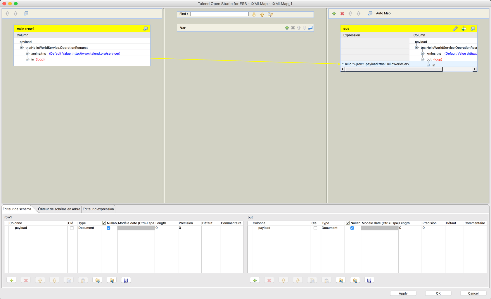

    * Sauvegarder et quitter.


* Lancer votre Job (cela permettra de publier votre service web sur le port 8090).
Vérifier que votre fichier WSDL existe bien.

### Tester le service SOAP
Il est possible de tester votre service de plusieurs manières. L'une d'elles est d'utiliser un outil léger de test appelé *SOAPUI*.

* Lancer SOAPUI
* Cliquer sur l'icône SOAP en haut de la fenêtre principale
* Donner un nom au projet (par exemple Helloworld) et entrer l'adresse du fichier WSDL du service, comme suit:

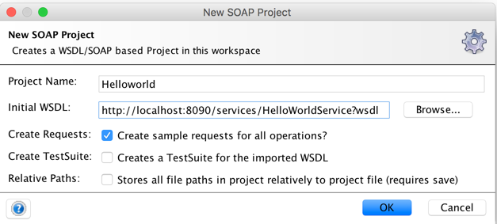

* Double cliquer sur la requête générée, et remplir le *<in>?</in>* par un nom de votre choix.
* Cliquer sur la flèche verte. Le résultat devra ressembler au suivant:

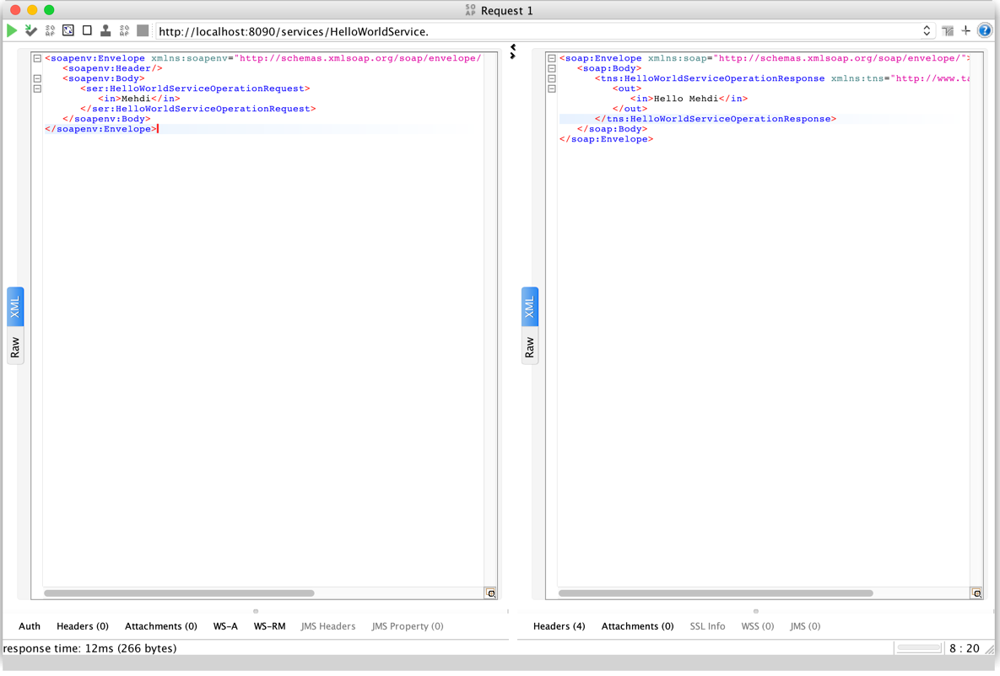

## Consommateur du WebService SOAP

Nous allons maintenant créer un consommateur pour notre service avec talend open studio. Pour cela:

* Créer un nouveau Job, que vous appellerez *HelloWorldServiceConsumer*.
* Concevez votre job de manière à ce qu’il ait l’allure suivante:

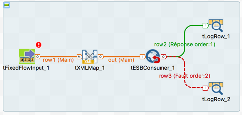

* Voici les rôles des éléments que vous avez ajouté :

    - **tFixedFlowInput** : définir les entrées à envoyer à votre service
    - **tXMLMap** : associer les entrées définies aux entrées du service
    - **tESBConsumer** : consommateur du service
    - **tLogRow**: afficher les réponses et/ou les fautes (s’il y’en a)

* Configurer votre composant *tFixedFlowInput*. Pour cela:

    * Cliquer sur *Modifier le schéma* et ajouter une colonne appelée *Nom* de type *String*.
    * Utiliser une *Inline Table* pour ajouter les trois chaînes en entrée: “Alice”, “Bob” et “Chuck”.


* Configurer votre *tESBConsumer* en lui donnant comme WSDL celui du service que
vous avez créé. Vérifiez bien que le Endpoint soit sur le port 8090.
* Configurer votre *tXMLMap* pour que la variable *Nom* soit associée au *in* de votre
service.
* Exécuter le Job, et observez le résultat. Votre console devrait afficher le résultat suivant:

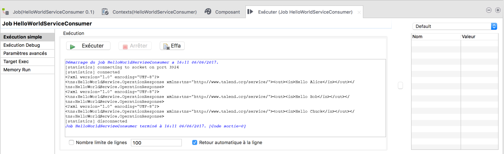

## Service Web REST : Interrogation d'une base de données

Nous allons maintenant montrer comment exposer un service REST pour interroger une base de données.

### Création de la base de données

Nous allons commencer par créer une base de données (MySQL dans mon cas), appelée *eservices-tp1* avec une table, que nous appellerons *user*. Cette table contient les champs *id*, *firstname* et *lastname*. Remplir ensuite la base à votre guise, de manière à avoir au moins 4 entrées.

Elle devra ressembler à ce qui suit:

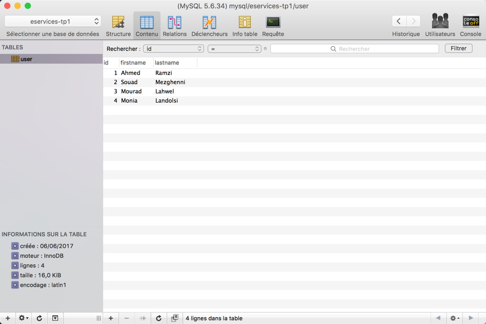

### Ajout de la connexion à la base avec Talend
Pour configurer une connexion à cette base de données avec Talend, suivre les étapes suivantes:

* Dans les Métadonnées, sous *Connexions aux bases de données*, clic-droit, puis choisir: *Créer une connexion*.
* Configurer votre connexion. Voici un exemple:

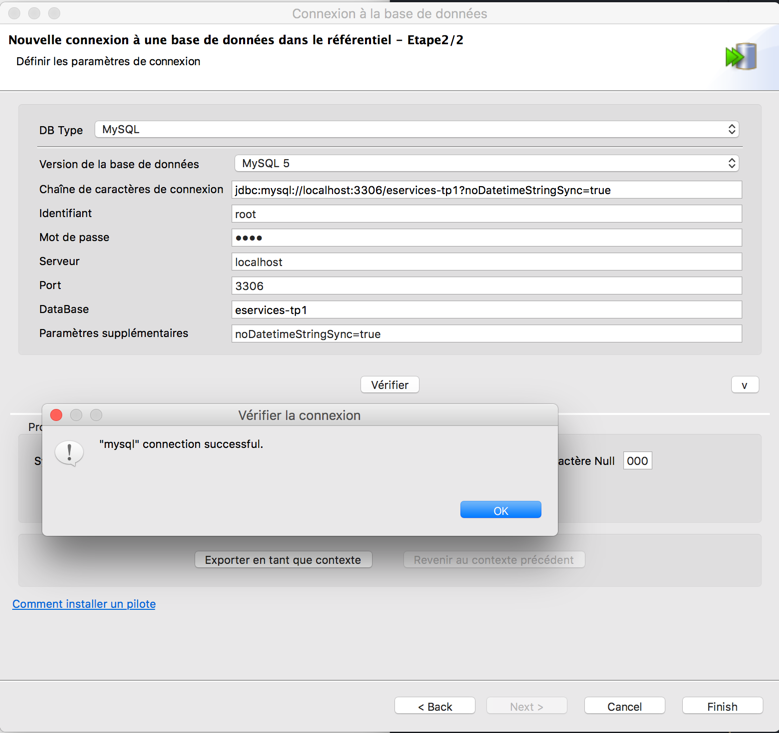

* Une fois la connexion créée, importer son schéma. Pour cela, clic-droit sur Metadonnées -> Connexions... -> **<nom-connexion>** et choisir: *Récupérer le schéma*.
* Sélectionner la table *user*, et vérifier que les champs sont bien chargés dans la partie Schéma.

### Création du service REST
Nous allons maintenant créer le service REST. Pour cela, créer un nouveau job, qu'on appellera *DBService*, puis glisser les composants suivants:

* **tRestRequest** : Pour définir la requête REST que le client doit appeler
* **user** : Table de la base de données. Dans la nouvelle connexion à la base de données que vous avez créé, sous *Schémas des tables*, glisser la table *user* vers le Job, puis choisir tMySQLInput dans la fenêtre de choix qui apparaît.

!!! tip "Remarque"

    Je choisis *tMySQLInput* car, dans mon cas, c'est une base de données MySQL, et je veux juste lire son contenu, je vais donc y accéder en entrée (d'où le *Input*).

* **tFlowToIterate** : Pour effectuer une itération sur les données d'entrée et génèrer des variables globales.
* **tXMLMap** : Permet de router et transformer les flux entrants de la base de données vers le résultat de la requête.
* **tRestResponse** : Pour définir la réponse à envoyer à l'utilisateur suite à sa requête.
* **tLogRow** : Pour le log, bien sûr.

Le job aura l'allure suivante:

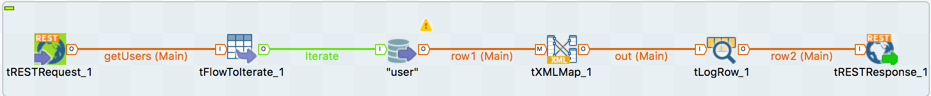

### Configuration du service REST
Nous désirons configurer le service de manière à ce que, quand un consommateur appelle l'URI:
`http://localhost:8088/users?from=1&to=3`, le service retourne une réponse contenant les utilisateurs (id, nom et prénom) de la base de données dont les ids figurent entre 1 et 3.

#### Configuration de tRestRequest
tRestRequest devra être configuré comme suit:

* La valeur de *Endpoint URL* devra être: `"http://localhost:8088/users"`
* Si vous avez connecté le tRestRequest avec le tFlowToIterate avec un lien appelé *getUsers*, vous devriez le retrouver dans la case *REST API Mapping*. Sinon, créez-le.
* Garder les informations par défaut de ce mapping (méthode GET, URI /, Produit XML ou JSON).
* En cliquant sur *getUsers*, un bouton avec trois petits points apparaît. Cliquez dessus.
* Ajouter les deux colonnes *from* et *to* représentant les deux paramètres de la requête. Prenez soin à ce que:

    * Leur type soit *int*
    * Leurs valeurs par défaut soient respectivement 1 et 3.


    !!! tip "Remarque"
        Ces valeurs seront utilisées dans le cas où le consommateur n'introduit pas de paramètres.

    * Leur commentaire ait la valeur: *query*


    !!! tip "Remarque"
        Cela indique que ces champs sont des paramètres de requête, pas définies dans le Path.

#### Configuration de user
Puisque le composant *user* a été créé à partir de la connexion à votre base MySQL, il contient déjà les informations de connexion nécessaires.

Il suffira dans notre cas de:

* Cliquer sur *Guess Schema*  pour charger le schéma de la base.
* Changer la requête pour qu'elle soit comme suit:

```sql
"SELECT * FROM `user` where id>="+globalMap.get("getUsers.from")+
                      " and id<="+globalMap.get("getUsers.to")
```

!!! tip "Remarque"
    globalMap est une variable globale permettant de stocker les informations de la requête, comme par exemple ses paramètres.

#### Configuration de tXMLMap
Cliquer deux fois sur la *tXMLMap* pour la configurer.

* Dans la colonne de droite, ajouter (si ce n'est déjà fait) une colonne intitulée *body* dont le type est *Document*.
* Cette colonne contient un élément *root*. Renommer cet élément pour *users*.
* Ajouter un sous-élément à *users* appelé *user*.
* Définir cet élément comme *loop Element*.
* Glisser-déplacer l'id de la colonne en entrée vers le *user*. Créez-le comme attribut du noeud cible.
* De même pour le *firstname* et *lastname*, qui seront, eux, des sous-éléments du noeud *user*.
* Dans la colonne de droite, cliquer sur la petite clef à molette (). Mettre la valeur de "All in one" à *true*. Cela permettra à toutes les données XML d'être écrites dans un seul flux.

La configuration finale sera donc comme suit:


!!! tip "Indication"
    La configuration précédente va générer une réponse de la forme suivante:

    ```XML
    <users>
      <user id=1>
        <firstname> flen </firstname>
        <lastname> fouleni </lastname>
      </user>
      <user id=2>
        <firstname> flena </firstname>
        <lastname> foulenia </lastname>
      </user>
    <users>
    ```

Les autres composants devront rester tels qu'ils sont par défaut. Il suffira maintenant de lancer le service, en cliquant sur *Exécuter*.

### Tester le Service
#### Dans un navigateur
Pour tester le service, il suffit d'ouvrir un navigateur, et de taper la requête de votre choix.

Par exemple, la requête suivante : `http://localhost:8088/users?from=2&to=4` donnera:

```XML
  <users>
      <user id="2">
          <firstname>Souad</firstname>
          <lastname>Mezghenni</lastname>
      </user>
      <user id="3">
          <firstname>Mourad</firstname>
          <lastname>Lahwel</lastname>
      </user>
      <user id="4">
          <firstname>Monia</firstname>
          <lastname>Landolsi</lastname>
      </user>
  </users>
```
Si aucun paramètre n'est indiqué: `http://localhost:8088/users` cela donnera:

```XML
  <users>
      <user id="1">
          <firstname>Ahmed</firstname>
          <lastname>Ramzi</lastname>
      </user>
      <user id="2">
          <firstname>Souad</firstname>
          <lastname>Mezghenni</lastname>
      </user>
      <user id="3">
          <firstname>Mourad</firstname>
          <lastname>Lahwel</lastname>
      </user>
  </users>
```
#### Avec SOAPUI
### Tester le service SOAP
Il est possible de tester votre service REST avec *SOAPUI*.

* Lancer SOAPUI
* Cliquer sur l'icône REST en haut de la fenêtre principale
* Entrer l'URI que vous désirez tester: `http://localhost:8088/users?from=2&to=4`
* La fenêtre suivante devrait apparaître:

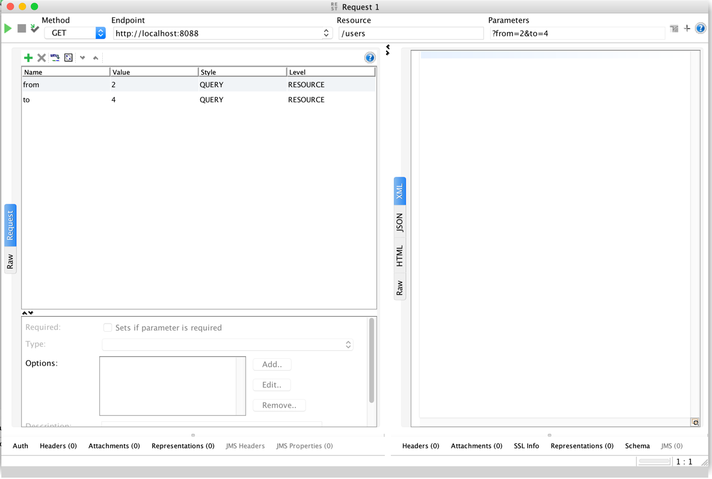


* Cliquer sur la flèche verte. Le résultat devra ressembler au suivant:

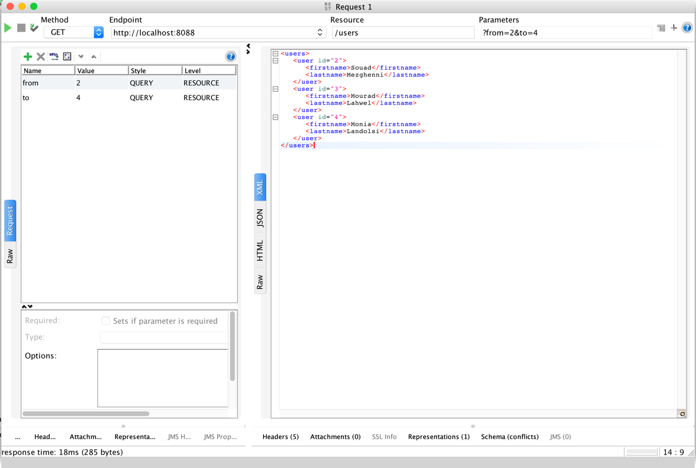

## Consommateur du WebService REST

Pour créer un consommateur pour le web service REST avec Talend, il suffit de créer le Job suivant:

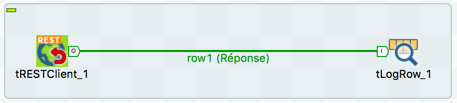

Configurer le *tRestClient* comme suit:

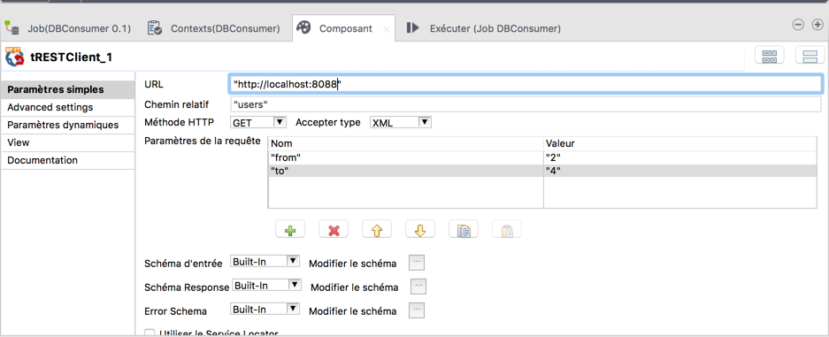

Exécuter. Le résultat devrait ressembler à ceci:

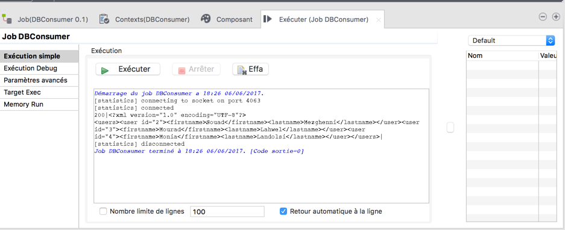
