# TP2 - Orchestration de Services avec Camunda


## Télécharger PDF
[](tp2.pdf)

## Objectifs du TP
Création d'un processus métier (Business Process) en utilisant Camunda.

## Outils et Versions
* [Camunda](https://camunda.org/download/) Version: 7.7.0
* [Java](http://www.oracle.com/technetwork/java/javase/downloads/index-jsp-138363.html) Version 1.8.0_121 (7+ needed).
* [IntelliJ IDEA](https://www.jetbrains.com/idea/download/) Version Ultimate 2016.1 (ou tout autre IDE de votre choix)
* [Camunda Modeler](https://camunda.org/download/modeler/) Version 1.10.0

## Camunda [](https://camunda.org)
Camunda est une plateforme open source pour la gestion des processus métier. C'est un framework Java qui support **BPMN** pour l'automatisation des processus, **CMMN** pour le Case Management, et **DMN** pour le Business Decision Management.


## BPMN 2.0 [](http://www.bpmn.org/)
BPMN 2.0 (Business Process Modeling Notation) est un standard développé par le Object Management Group (**OMG**) pour fournir une notation facilement compréhensible par tous les utilisateurs métier: les analystes métier, les développeurs implémentant les technologies exécutant ces processus et les personnes gérant et supervisant ces processus. BPMN permet d'établir un pont minimisant le gap entre les conceptions des processus et leurs implémentations.

Dans sa première version, la spécification BPMN permettait de fournir uniquement une notation graphique, et est devenue rapidement célèbre parmi les analystes métier. Elle définissait la manière dont les concepts tels que les tâches humaines et les scripts exécutables, pouvaient être visualisées de manière standard, indépendante d'un constructeur particulier.

Cette deuxième version étend ce standard en incluant des sémantiques d'exécution et un format d'échange commun. Ce qui veut dire que les modèles de processus BPMN 2.0 peuvent être échangés entre des éditeurs graphiques différents, et exécutés sur n'importe quel moteur compatible avec BPMN 2.0, tel que Camunda et Activiti.


## Installation
Pour installer l'environnement nécessaire à ce TP, il faut suivre les étapes suivantes:

* Télécharger [Camunda](https://camunda.org/download/) (Distribution Tomcat), [IntelliJ IDEA](https://www.jetbrains.com/idea/download/) et [Camunda Modeler](https://camunda.org/download/modeler/).
* Décompresser le fichier .zip Camunda téléchargé, et exécuter *start-camunda.sh* (pour les systèmes Unix-based) ou *start-camunda.bat* (pour les systèmes Windows).
* Ouvrir la page d'accueil du serveur d'application dans votre navigateur préféré.
* Lancer le Camunda Modeler.

## Premier Projet Camunda BPMN: Helloworld

### Création du Projet et Dépendances


Vous allez maintenant créer un nouveau projet Java pour définir le comportement de votre processus.

* Ouvrir IntelliJ et créer un nouveau projet Maven (sans archetype).
* Vous pouvez choisir les paramètres suivants:

    * Group Id: *tn.insat.eservices.tp2*
    * Artifact Id: *Helloworld*
    * Project Name: *HelloworldCamunda*

* Dans le fichier *pom.xml*, indiquer que l'application sera déployée plus tard sous la forme d'un fichier *war*. Pour cela, ajouter la ligne suivante, juste après la version:

```xml
<packaging>war</packaging>
```

* Ajouter les dépendances nécessaires vers Camunda dans votre projet. Pour cela, insérer les lignes suivantes dans votre fichier *pom.xml*

```xml
<dependencyManagement>
    <dependencies>
      <dependency>
        <groupId>org.camunda.bpm</groupId>
        <artifactId>camunda-bom</artifactId>
        <version>7.7.0</version>
        <scope>import</scope>
        <type>pom</type>
      </dependency>
    </dependencies>
  </dependencyManagement>

  <dependencies>
    <dependency>
      <groupId>org.camunda.bpm</groupId>
      <artifactId>camunda-engine</artifactId>
      <scope>provided</scope>
    </dependency>

    <dependency>
      <groupId>javax.servlet</groupId>
      <artifactId>javax.servlet-api</artifactId>
      <version>3.0.1</version>
      <scope>provided</scope>
    </dependency>
  </dependencies>

  <build>
    <plugins>
      <plugin>
        <groupId>org.apache.maven.plugins</groupId>
        <artifactId>maven-war-plugin</artifactId>
        <version>2.3</version>
        <configuration>
          <failOnMissingWebXml>false</failOnMissingWebXml>
        </configuration>
      </plugin>
    </plugins>
  </build>
```

* Faire un build de votre projet. Pour cela, créer une nouvelle configuration de type Maven, que vous appellerez *maven-install* par exemple, et vous écrirez dans la partie **Command Line** : *install*, comme suit:

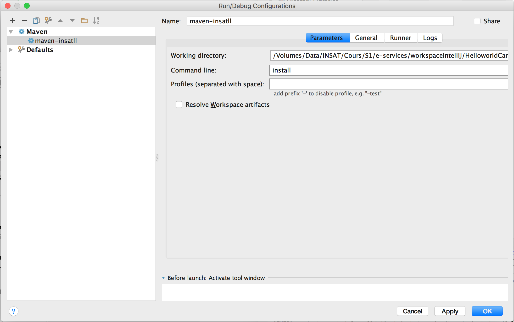

* Lancer le build et vérifiez bien que vos packages ont bien été installés.

### Création de la classe principale pour le processus
La prochaine étape permet de construire une classe pour le processus. Cette classe représente l'interface entre votre application et le moteur de processus Camunda.

``` java
package tn.insat.eservices.tp2.helloworld;

import org.camunda.bpm.application.ProcessApplication;
import org.camunda.bpm.application.impl.ServletProcessApplication;

@ProcessApplication("Helloworld App")
public class HelloworldApplication extends ServletProcessApplication {
    // empty implementation
}
```

Ajouter ensuite le fichier *processes.xml* sous le répertoire *src/main/resources/META-INF*. Ce fichier nous permet de fournir une configuration pour le déploiement de ce processus dans le moteur de processus.


``` xml
<?xml version="1.0" encoding="UTF-8" ?>
<process-application
        xmlns="http://www.camunda.org/schema/1.0/ProcessApplication"
        xmlns:xsi="http://www.w3.org/2001/XMLSchema-instance">

    <process-archive name="helloworld">
        <process-engine>default</process-engine>
        <properties>
            <property name="isDeleteUponUndeploy">false</property>
            <property name="isScanForProcessDefinitions">true</property>
        </properties>
    </process-archive>

</process-application>
```

A partir de ce point, nous allons commencer à modéliser le processus.

### Modélisation d'un processus BPMN 2.0
La modélisation du processus se fera grâce au *Camunda Modeler*. Pour cela:

* Démarrer l'application, et créer un nouveau diagramme BPMN en cliquant sur *File > New File > BPMN Diagram*.

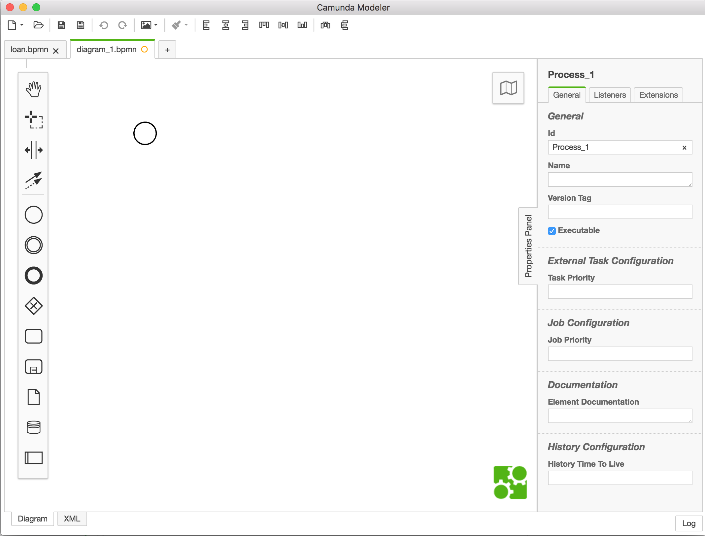

* Double-cliquer sur l'évènement de départ (le petit rond) pour modifier son nom. Nous l'appelerons *Dis Bonjour*.
* Cliquer sur l'évènement de départ, choisir le rectangle (représentant une activité) à partir du menu contextuel qui apparaît, et le glisser vers un emplacement adéquat. Nous appellerons le nouvel évènement inséré *Ajouter Bonjour*.

<center></center>

* Cette tâche sera celle où l'utilisateur va indiquer son nom pour l'éternel **Bonjour <nom\>!**. Pour cela, nous devons indiquer que le traitement fait ici sera réalisé par un humain. Pour cela, en cliquant sur l'activité créée, cliquer dans le menu contextuel sur la clef à molette, puis choisir *User Task*.

<center>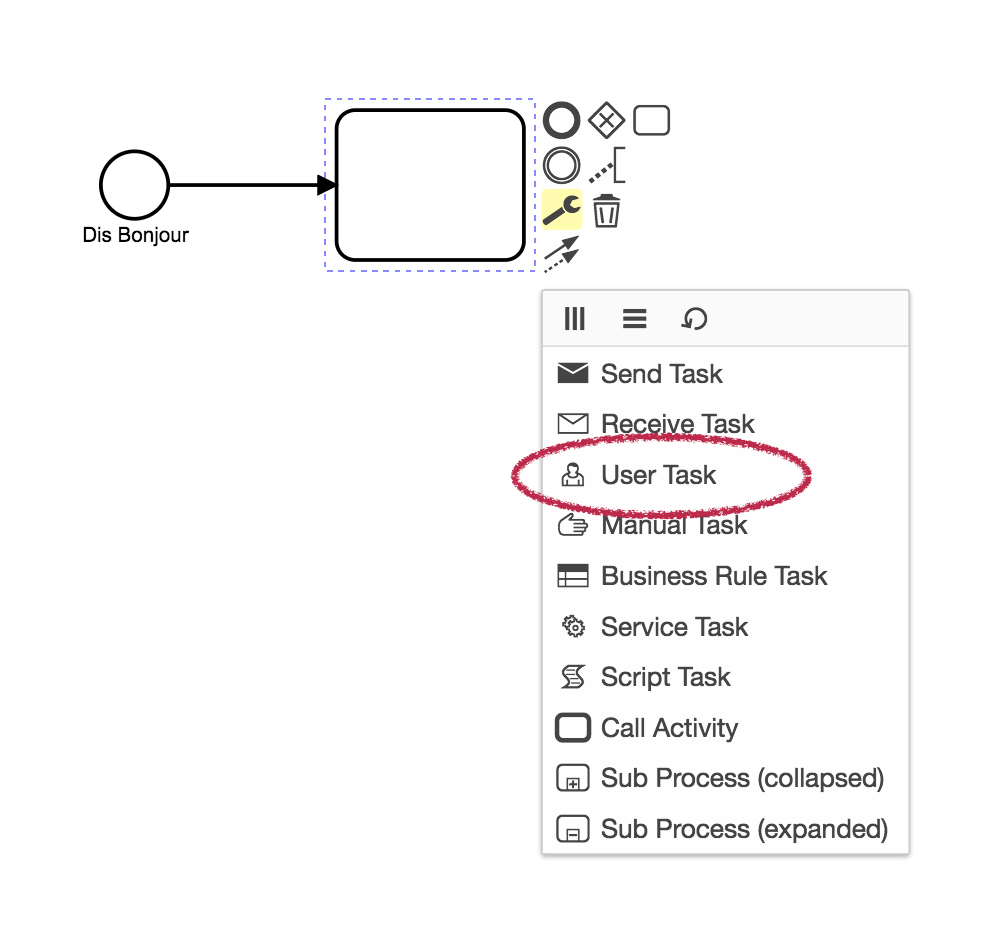</center>

* Rajouter une tâche de fin au processus.

Nous obtenons pour finir le diagramme suivant:

<center>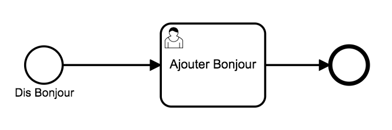</center>


### Configuration du processus

* Pour configurer la tâche utilisateur *Ajouter Bonjour*, cliquer dessus, et remplir le panneau des propriétés (sur la droite). Définir l'utilisateur auquel sera destinée cette activité. Pour cela, dans le champ *Assignee*, insérer *john*. John est un utilisateur prédéfini sur le serveur Camunda. Plus tard, vous pourrez définir votre propre liste d'utilisateurs et de rôles.
* Pour configurer le processus en entier, cliquer sur un endroit vide du canevas. Dans le panneau des propriétés, indiquer les champs suivants:
    - Id: *helloworld*
    - Name: *Helloworld*
    - Executable: *true*

Vous obtiendrez le résultat suivant:

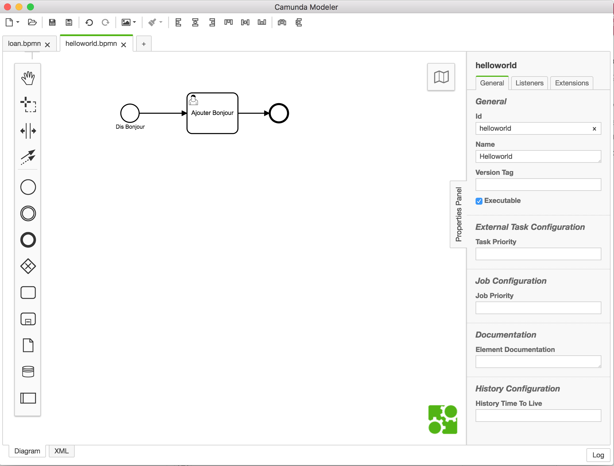

* Sauvegarder le diagramme sous le répertoire *src/main/resources* du projet que vous avez créé. Vous l'appellerez *helloworld.bpmn*

### Déploiement du processus

* Configurer l'application pour qu'elle soit déployée sur le serveur tomcat intégré dans votre installation Camunda. Pour cela, dans IntelliJ:

    - Aller au menu *File > Project Structure...*
    - Cliquer sur *Artifacts*.
    - Définir le type de l'archive à déployer: *Web Application: Archive*
    - Définir comme Output Directory le répertoire *webapps*, se trouvant en général sous le répertoire *$CAMUNDA_HOME/server/apache-tomcat-<version\>/webapps*.
    - En bas de la fenêtre, vous trouverez un bouton *Create Manifest*. Cliquer dessus, cela permettra de créer le fichier Manifest responsable du déploiement.
    - Vous obtiendrez le résultat suivant:

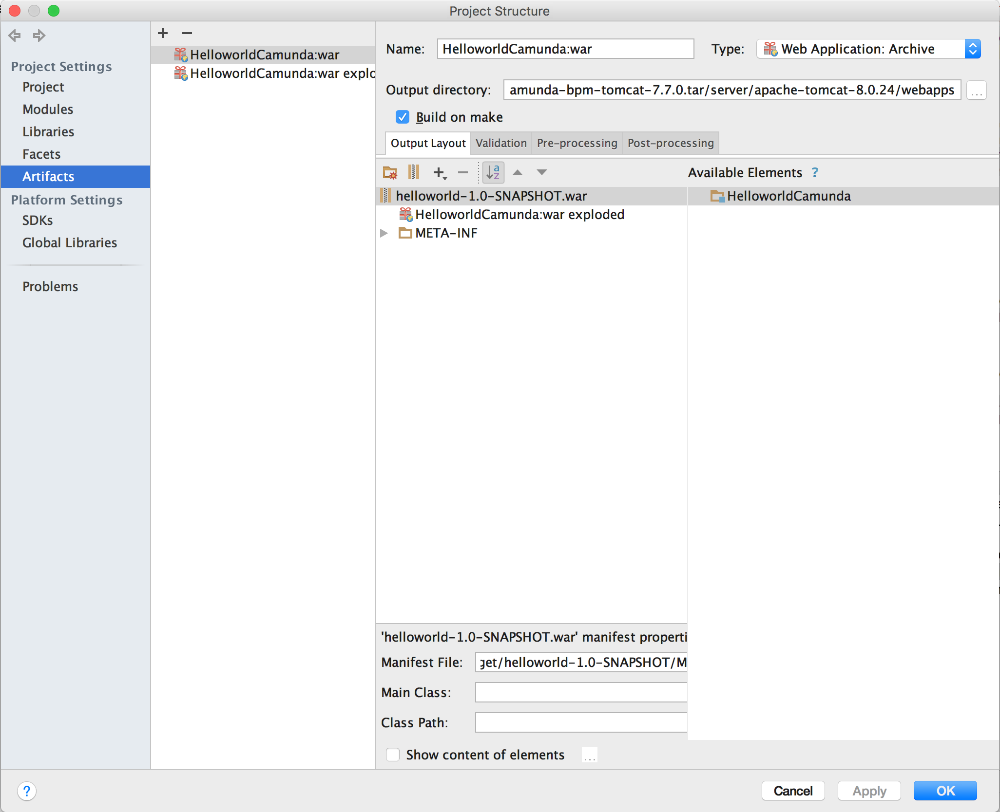

  - Faire un *make* du projet. Pour cela, aller au menu *Build > Make Project* ou cliquer sur . Normalement, un nouveau fichier *helloworld-1.0-SNAPSHOT.war* sera créé dans le répertoire *webapps* du serveur.

Pour vérifier que le processus a bien été déployé sur le serveur Tomcat, consulter le fichier log se trouvant sous *$CAMUNDA_HOME/server/apache-tomcat-<version\>/logs* et ouvrir le fichier *catalina.out*.

!!! tip
    Le meilleur moyen de consulter en permanence le fichier log sur les systèmes Linux-like est d'ouvrir un terminal, et de taper `tail -f catalina.out`.

Le fichier devra contenir les lignes suivantes:

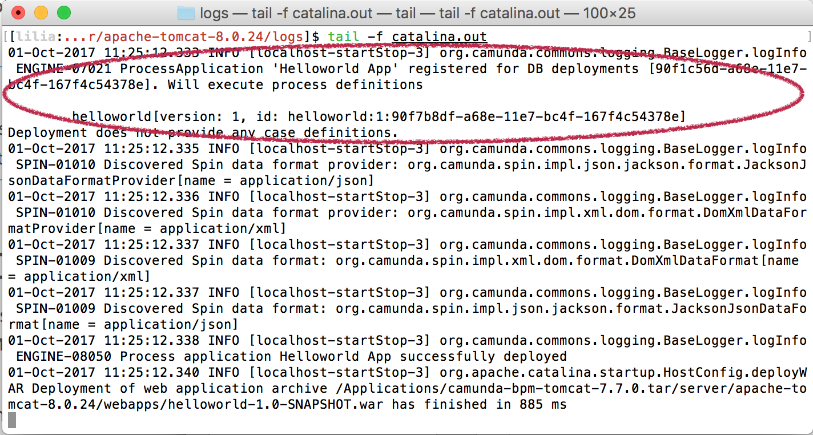

### Vérification du déploiement avec Cockpit

Camunda offre l'outil *Cockpit* pour inspecter les processus en cours d'exécution et complétés, et gérer les différents incidents. Pour cela, si votre serveur Camunda est bien lancé, vous pourrez visualiser vos processus dans le navigateur, en tapant: `http://localhost:8080/camunda/app/cockpit`. Identifiez-vous comme administrateur en tapant les credentials: `demo/demo`. Cliquer sur le nombre sous *Process Definitions* (cela devra être **2** dans votre cas), vous devriez retrouver votre processus, avec un état *checked*.

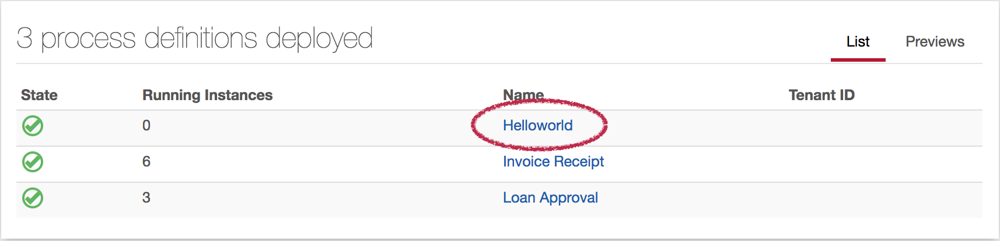

### Démarrage du processus

* Aller au *Camunda Tasklist* (`http://localhost:8080/camunda/app/tasklist`), puis lancer le processus en cliquant sur le bouton *Start Process* (en haut à droite).
* Cliquer sur votre processus *Helloworld*.
* Ajouter autant de variables que nécessaire dans le formulaire générique. Nous allons dans notre cas ajouter une variable *nom* de type chaîne de caractères. Pour cela, cliquer sur *Add a variable* et remplir comme suit (mettez votre nom bien sûr, pas le mien :smiley: ):

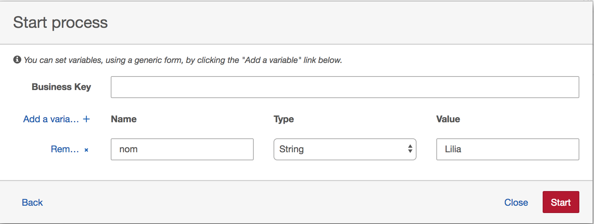

* En rafraîchissant maintenant le Cockpit, vous trouverez que le processus est passé à l'état *Running*.

### Configuration des permissions
Pour permettre à l'utilisateur John de visualiser et lancer le processus *Helloworld*, il faudra lui rajouter les autorisations. Pour cela:

* Aller à *Camunda Admin* (`http://localhost:8080/camunda/app/admin/default/#/authorization?resource=0`).
* Ajouter une nouvelle autorisation dans la partie *Process Definition*, pour permettre à John de manipuler la définition du processus *Helloworld*.

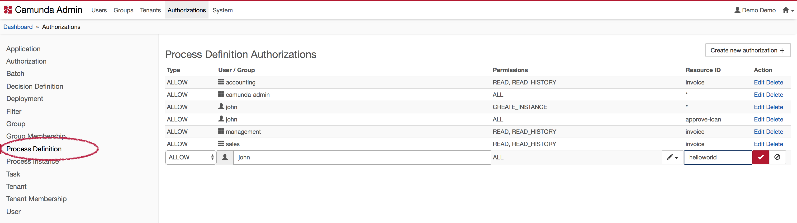

* Dans la partie *Process Instance*, ajouter la permission de créer une instance de processus à John.

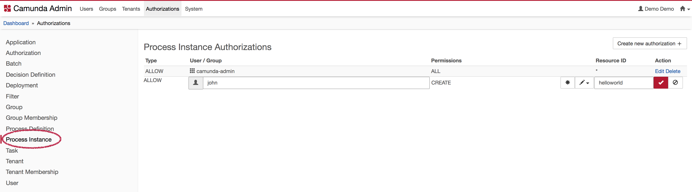

* Vous authentifier comme étant John, en utilisant (*john/john*), de préférence sur un autre navigateur. Vous pourrez ainsi visualiser le processus Helloworld, tel qu'il est visible par John. Il pourra ainsi ajouter les variables de son choix, et compléter le processus.

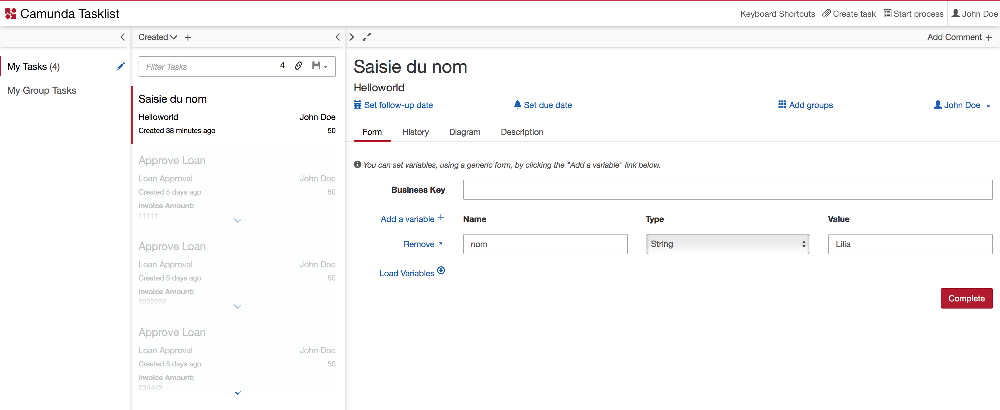

### Création d'un formulaire personnalisé
Pour créer votre propre formulaire, avec des variables en entrée qui peuvent être manipulées par le service,  suivre les étapes suivantes:

* Revenir vers IntelliJ, et créer un fichier *dis-bonjour.html* sous le répertoire *src/main/webapp/forms*. Ajouter le contenu suivant:

```html
<form name="disBonjour">
    <div class="form-group">
        <label for="nom">Nom</label>
        <input class="form-control"
               cam-variable-type="String"
               cam-variable-name="nom"
               name="nom" />
    </div>
</form>
```

* Ouvrir le processus avec le Modeler, et cliquer sur l'évènement de départ. Dans le panneau des propriétés, choisir la tabulation *Forms*  et insérer `embedded:app:forms/dis-bonjour.html` dans le champ *Key*. Cela indique que nous voulons utiliser un formulaire intégré dans la Tasklist, et qu'il sera chargé à partir de l'application.
* Sauvegarder, et rafraîchir le projet dans IntelliJ.
* De même, nous allons créer le formulaire qui va permettre à John de dire Bonjour. On l'appellera *bonjour.html*.

```html
<form name="bonjour">
    <div class="form-group">
        <label for="salutation">Salutation</label>
        <input class="form-control"
               cam-variable-type="String"
               cam-variable-name="salutation"
               name="salutation" />
    </div>
    <div class="form-group">
        <label for="nom">Nom</label>
        <input class="form-control"
               cam-variable-type="String"
               cam-variable-name="nom"
               name="nom"
               readonly="true" />
    </div>
</form>
```

* Affecter ce formulaire à la tâche *Ajouter Bonjour* de la même manière que précédemment.
* Sauvegarder tout et re-déployer le projet.
* Lancer maintenant le processus. Saisir votre nom dans la rubrique *Nom*.

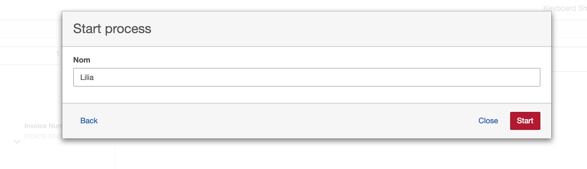

* Identifiez-vous comme John de nouveau, vous trouverez le deuxième formulaire:

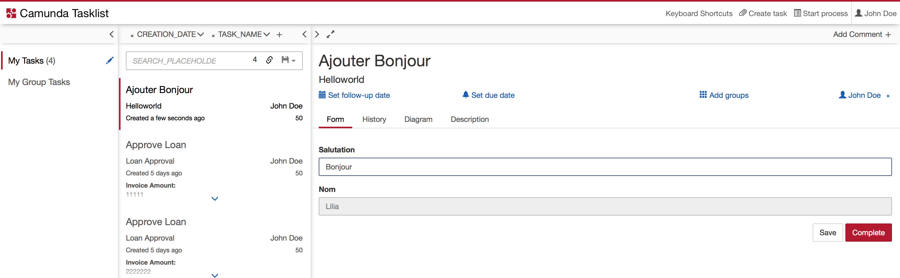

Pour l'instant, en cliquant sur compléter, rien ne se passe, car nous n'avons indiqué nulle part ce qui doit être réalisé suite à la saisie du "Bonjour" par John. Cela sera fait grâce à un *Service Task*.

### Ajout d'un Service Task Java
Pour définir le comportement à faire de votre service, suivre les étapes suivantes:

* Utiliser le Modeler pour ajouter un service task juste après le user task. Pour cela, sélectionner une activité dans la palette de gauche, et la glisser entre la tâche utilisateur et l'évènement de fin. Avec la clef à molette  , sélectionner l'option *Service Task*. Appeler le service *Dire Bonjour*. Vous obtiendrez le résultat suivant:

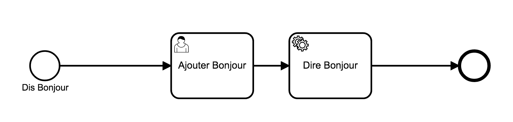

* Ajouter maintenant l'implémentation du Service Task. Pour cela, ajouter une classe dans le projet IntelliJ appelée *ProcessRequestDelegate* qui implémente l'interface *JavaDelegate*, comme suit:

```Java
package tn.insat.eservices.tp2.helloworld;

import java.util.logging.Logger;
import org.camunda.bpm.engine.delegate.DelegateExecution;
import org.camunda.bpm.engine.delegate.JavaDelegate;

public class ProcessRequestDelegate implements JavaDelegate {

    private final static Logger LOGGER = Logger.getLogger("Hello-Greetings");

    public void execute(DelegateExecution execution) throws Exception {
        LOGGER.info("Hey! " + execution.getVariable("salutation")
                    + " " + execution.getVariable("nom") + "!");
    }

}
```

* Utiliser le panneau des propriétés pour référencer la classe dans le processus. Pour cela, cliquer sur le Service Task, et définir son implémentation par la Java Class: `tn.insat.eservices.tp2.helloworld.ProcessRequestDelegate`.
* Déployer votre application, et observer le résultat. Il sera affiché dans le log de votre serveur Tomcat (catalina.out), comme suit:

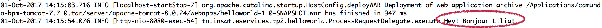

## Appel d'un Service Web REST
Grâce aux connecteurs, Camunda peut intégrer des services web REST ou SOAP. Pour cela, nous allons faire appel à un service web classique de météo. Dans son formulaire, John va saisir le nom d'une ville, et le processus devra retourner la température actuelle dans cette ville, en plus de l'usuel Bonjour.

* Commencer par ajuster le formulaire *bonjour.html*, en lui ajoutant un autre champs de texte: *ville* après le champs *nom*.
* Revenir dans le Modeler, et ajouter un Service Task, qu'on appellera *Consulter Météo*, entre *Ajouter Bonjour*  et *Dire Bonjour*.
* Dans ce service, indiquer que le type d'implémentation est *Connector*, et vous déplacer vers l'onglet *Connector* pour le configurer.
* Donner les paramètres suivants à votre connecteur;
    - **Id**: *http-connector*
    - **Input**: Les input prendront toutes les informations nécessaires pour envoyer la requête REST au service web *OpenWeatherMap*. Ce service prend en paramètre la ville, qui sera insérée dans notre cas à partir du formulaire précédent, dans le champs *ville*.

    |Nom|Type|Valeur|
    |-------|--------|-----------------------------------------------------|
    | url | Script / JavaScript / Inline Script |  ``` var ville=execution.getVariable("ville"); 'http://api.openweathermap.org/data/2.5/weather?APPID=17db59488cadcad345211c36304a9266&q='+ville; ```|
    | method  | Text  | GET  |
    |  headers | Map  | `key: accept, value:application/json -       key:content-type, value:application/json`  |

    - **Output**: Le service utilisé renvoie un document json qui ressemble à ce qui suit:

```JavaScript
{
  coord: {
    lon: 10.17,
    lat: 36.82
  },
  weather: [
    {
      id: 801,
      main: "Clouds",
      description: "few clouds",
      icon: "02d"
    }
  ],
  base: "stations",
  main: {
    temp: 299.87,
    pressure: 1018,
    humidity: 39,
    temp_min: 299.15,
    temp_max: 301.15
  },
  visibility: 10000,
  wind: {
    speed: 3.6,
    deg: 40
  },
  clouds: {
    all: 20
  },
  dt: 1506864600,
  sys: {
    type: 1,
    id: 6318,
    message: 0.0039,
    country: "TN",
    sunrise: 1506834907,
    sunset: 1506877308
  },
  id: 2464470,
  name: "Tunis",
  cod: 200
}
```

Si l'objectif est de retourner la valeur de la température, on doit naviguer vers l'élément *main* puis à son fils *temp*. L'output de notre service aura donc la forme suivante:


|Nom|Type|Valeur|
|----|----|------------------------------------------------------------|
| WsResponse | Script / JavaScript / Inline Script |  ` S(response).prop("main").prop("temp").numberValue(); `|

!!! tip
    Toujours tester votre web service REST sur navigateur avant de l'utiliser dans une quelconque application!

* Maintenant, ajouter le code d'exploitation de ce service dans la classe *ProcessRequestDelegate*, pour lui indiquer d'afficher le résultat de la requête:

```java
public class ProcessRequestDelegate implements JavaDelegate {

    private final static Logger LOGGER = Logger.getLogger("Hello-Greetings");

    public void execute(DelegateExecution execution) throws Exception {
        LOGGER.info("Hey! " + execution.getVariable("salutation") + " "
                + execution.getVariable("nom")
                + "! La température aujourd'hui à "
                + execution.getVariable("ville")
                + " est de "
                + execution.getVariable("WsResponse")+"!");
    }

}
```

* Tout sauvegarder puis déployer le service. En l'exécutant, vous obtenez le résultat suivant:
    - L'utilisateur demo saisit son nom:


    - L'utilisateur john rajoute la salutation et la ville:


    - Le processus affiche ce résultat sur le log:
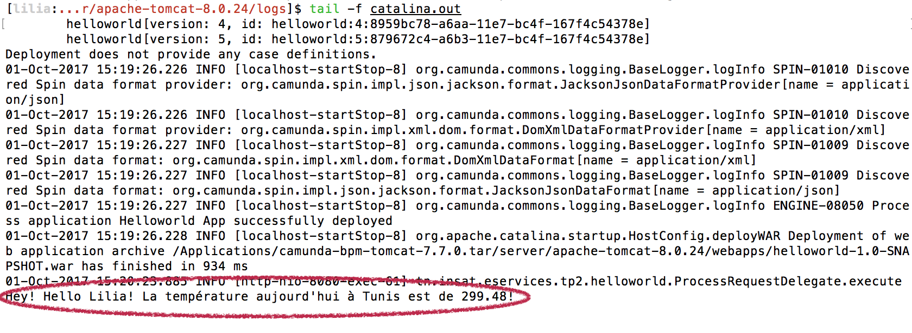

!!! faq "TAF"
    Vous remarquerez que le service web REST que nous avons appelé rend la température en degré Kelvin. Chercher un service web qui fasse la conversion du ºK vers le ºC, puis appelez-le avant de faire l'affichage.
