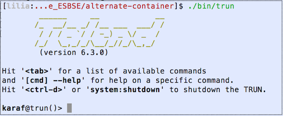
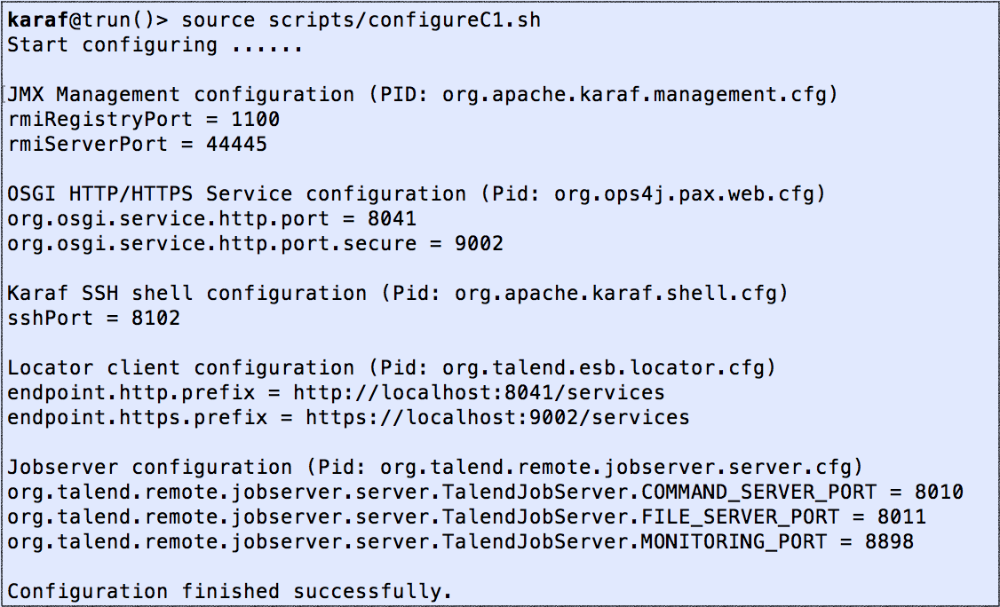
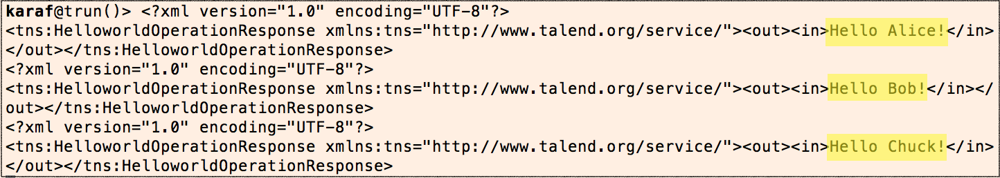
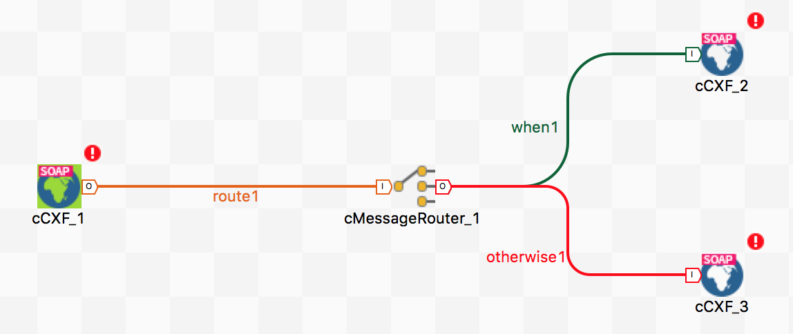
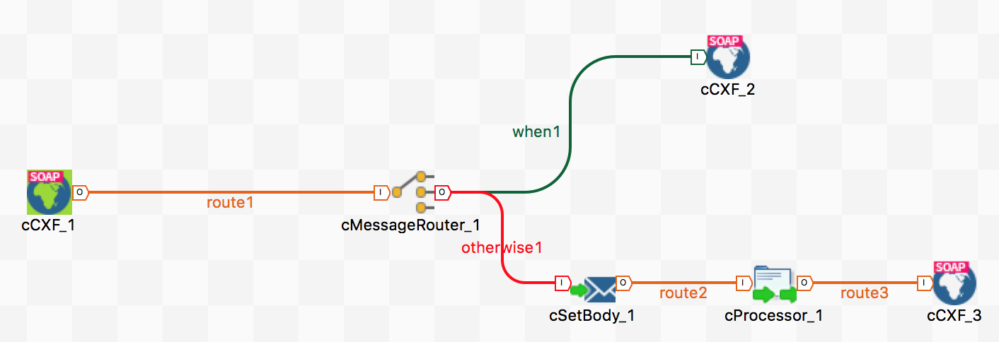
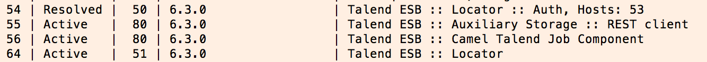
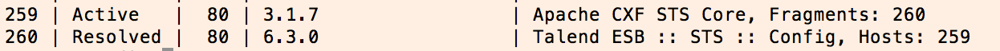

# TP3 - Mise en Place d’un ESB avec Talend ESB


## Télécharger PDF
[](tp3.pdf)

## Objectifs du TP
1. Routage, médiation et transformation avec Talend ESB.
2. Gestion du failover et répartition de charges, monitoring et authentification avec Talend ESB.

## Outils et Versions
* [Talend Open Studio for ESB](https://www.talend.com/download_page_type/talend-open-studio/) Version: 6.3.0
* [DB Visualizer](https://www.dbvis.com/download/) Version 10.0
* [Java](http://www.oracle.com/technetwork/java/javase/downloads/index-jsp-138363.html) Version 1.8.0_121

## Configuration et Utilisation de l'ESB Talend

### Lancement de deux instances de l'ESB Talend

Pour les besoins de notre TP, nous allons lancer deux instances de l’ESB Talend. Pour cela, l’environnement nous fournit une manière très simple de le faire:

  * Aller dans le répertoire *<rep_install_talend\>/Runtime_ESBSE*
  * Copier le répertoire *container* et le renommer en *alternate-container*.

Nous allons maintenant configurer la deuxième instance de l’ESB (dans *alternate-container*) pour qu’elle se lance sur un port différent de la première. Pour cela:

  * **Lancer l’ESB** : dans le répertoire *alternate-container* que vous venez de créer, aller vers *bin* et exécuter *trun.bash* (sur windows). Si vous êtes sur Linux ou mac, placez-vous sous le répertoire *alternate-container/bin* et  lancer dans un terminal la commande *./trun*. La fenêtre suivante devrait s’afficher:

<center></center>

!!! warning "Attention"
    Le premier contenaire ne doit pas être en exécution, sinon il y'aura un conflit d'adresses. Il faut d'abord configurer le second contenaire pour qu'il se lance sur un port différent, ce que nous allons faire dans l'étape suivante.

  * **Configurer l'ESB** : dans l’invite de commande affichée, taper:

``` bash
  source scripts/configureC1.sh
```

  * Un affichage tel que le suivant va apparaître:

<center></center>

Vous avez ainsi créé un ESB, que vous avez configuré pour se lancer sur le port 8041, alors que, par défaut, il devrait se lancer sur le port 8040. Si vous voulez créer une troisième instance, vous pouvez la configurer en utilisant le fichier configureC2.sh, de même pour une quatrième instance… Pour revenir à la configuration par défaut, utiliser configureC0.sh.

  * Arrêtez votre ESB, en cliquant sur ctrl-d, et relancez-le de nouveau.
  * Lancez dans un autre terminal l’instance de l’ESB se trouvant sous le répertoire d’origine container. Il est inutile de la configurer, elle se lancera par défaut sur le port 8040.

### Publier votre Service dans l'ESB et le Tester
Revenir au service web SOAP [HelloWorldService](tp1.md#service-web-soap-helloworld) que vous avez créé dans le TP1, et le publier sur l'ESB. Pour cela, ouvrir l'éditeur *Talend Open Studio* sur le projet *Helloworld*, et suivre les étapes suivantes:

  * Faire un clic-droit sur le service *HelloWorldService* et choisir *Exporter le service*. Choisir comme répertoire de destination le dossier *deploy* se trouvant dans le conteneur où vous désirez déployer le service. Un fichier archive de type kar sera alors créé sous ce répertoire, permettant ainsi son déploiement à chaud (pas besoin de redémarrer l’ESB).
  * Déployer votre service sur les deux instances d’ESB que vous avez démarré.
  * Vérifier que vos services sont actifs:
    - en tapant *list* dans vos deux instances d’ESB
    - en affichant les fichiers WSDL du service sur les ports 8040 et 8041 au lieu de 8090.

Pour tester votre service web:

  * Dans le job consommateur de service, dans les propriétés du composant tESBConsumer, modifier le port du endpoint de 8090 à 8040
  * Lancer votre job. Vérifier que l’affichage se fait correctement sur la console du TOS-ESB.

Vérifier que votre service s’exécute bien sur l’ESB principal, en consultant le terminal où il est démarré. Vous devriez trouver un affichage semblable à celui-ci:

<center></center>

##Création des Routes
Les routes permettent de définir le comportement que doit prendre le message selon son contenu. Dans notre exemple, nous allons définir deux types de routes: une route permettant de filtrer les messages par contenu, en envoyant les messages contenant le nom “Alice” vers un ESB, et le reste vers l’autre ESB. Une deuxième route permettra de modifier le contenu de certains messages avant de les faire parvenir à leurs destinataires.

###Première Route: Filtrage des Messages

  * Créer une nouvelle route en cliquant-droit sur *Routes -> Créer une Route*. Nous allons l’appeler FiltrageRoute.
  * Définir votre route de manière à ce qu’elle ressemble à ce qui suit:

<center></center>

  * Les composants utilisés sont:

    - **cCXF** : fournit l'intégration avec Apache CXF pour la connexion aux services JAX-WS.
    - **MessageRouter** : route des messages dans différents canaux selon des conditions spécifiées.

  * Configurer la condition *when*, en précisant que c’est une condition de type simple, dont le texte est :

```bash
    "${bodyAs(String)} contains 'Alice'"
```
  Cela veut dire que, si le corps du message contient *Alice*, la requête sera routée vers le composant *cCXF_2*.

  * Configurer le composant cCXF_1:

    * Adresse: http://localhost:8042/services/HelloWorldService
    * WSDL: http://localhost:8040/services/HelloWorldService?WSDL.

!!! tip "Remarque"

    Remarquez ici que le port utilisé pour l'adresse est 8042: c'est le port choisi pour le service façade fourni par la route. Le WSDL utilisé, par contre, est celui du service initial, exposé sur le port 8040, donc sur le premier ESB.

  * Configurer l’adresse de cCXF_2 sur le port 8040, et celle de cCXF_3 sur le port 8041, tout en gardant le même WSDL pour les trois composants.
  * Lancer la route pour la tester. La console devra afficher *connected*.

Pour utiliser cette route, vous devez reconfigurer votre consommateur pour qu’il lance sa requête sur le port 8042. Exécutez-le et observez le résultat sur les terminaux des deux instances d’ESB démarrées. Que constatez-vous?

###Déploiement des Routes sur l'ESB

Dans leur état actuel, vos routes doivent être lancées manuellement pour être prises en considération. Pour les déployer sur votre ESB et les garder ainsi toujours actives, suivre les étapes suivantes:

  * Faites un clic-droit sur votre route et sélectionner: *Build Route* (veillez à ce que le job FiltrageRoute soit bien arrêté).
  * Choisir le répertoire deploy du conteneur de votre choix.
  * Tester votre route en exécutant à nouveau le consommateur.

!!! warning "Attention"

    Vous ne devez en aucun cas déployer votre route sur deux contenaires, sinon, il y'aura un conflit, car deux services façades seront exposés, ayant la même adresse.

###Deuxième Route : Filtrage et Modification de Messages
Dans cette nouvelle partie, nous allons modifier le corps du message après l’avoir filtré. Pour cela:

  * Dans Talend Studio, dupliquer votre route *FiltrageRoute* et la nommer *ModificationRoute*.
  * Insérer un composant *cSetBody* (permettant de modifier le corps du message reçu) puis un composant *cProcessor* (permettant  de remanier rapidement du code dans la route) entre le *cMessageRouter* et le *cCXF_3*. Le but ici est de modifier le corps des messages reçus, selon leur contenu. Le résultat obtenu ressemblera au suivant:

<center></center>


  * Insérer le code suivant (de type Xpath) dans le *cSetBody* :

```
  "tns:HelloWorldServiceOperationRequest/in"
```

Ceci permet de saisir le contenu de la balise *in* de la requête SOAP envoyée par le consommateur. Il ne faut pas oublier de définir le Namespace *tns* (http://www.talend.org/service/).

  * Insérer le code suivant dans le processeur:

```Java
String name = exchange.getIn().getBody(String.class);
String surname;
if (name.contains("Bob")){
  surname = "Bobby";
}else{
  surname = "Chucky";
}
exchange.getIn().setBody("<tns:HelloWorldServiceOperationRequest "+
    "xmlns:tns=\"http://www.talend.org/service/\"><in>"
    +surname+"</in>	</tns:HelloWorldServiceOperationRequest>");
```

Ce code permet de modifier le corps du message entrant en remplaçant le nom par un surnom.

  * Modifier l'adresse du composant *cCXF_1* pour qu'il se lance sur le port 8043.
  * Sauvegarder et exporter votre route dans l’ESB. Lancer le consommateur de nouveau et observez le résultat.

##Fonctionnalités Supplémentaires de l'ESB
###Failover et Répartition de Charge
####Service Locator
Via le Service Locator, l'ESB de Talend fournit des fonctionnalités de gestion de failover automatique et transparente ainsi que de répartition de charge via le lookup et l'enregistrement d'endpoints dynamiques dans Apache Zookeeper. Le Service Locator maintient la disponibilité du service afin de répondre aux demandes et aux Service Level Agreements (SLAs).

####Configuration du Service Locator
Pour activer le service locator (SL), il faut:

  1. Déployer SL au niveau des conteneurs d’exécution Talend
  2. Activer la prise en compte du SL au niveau du service cible
  3. Configurer le consommateur du service pour prendre en compte le SL

#####1. Déploiement du SL dans le contenaire

Pour tester sa capacité à gérer le failover et la répartition des charges, le SL doit être déployé dans les différents conteneurs de services où sera déployé votre service. Pour cela, taper dans l’invite de commande de chaque conteneur ESB:

```properties
  tesb:start-locator
```

Il est possible de visualiser votre SL dans la liste des services déployés sur le conteneur en tapant list sur votre terminal. Vous devriez trouver les lignes suivantes:

<center></center>

#####2. Activer SL dans le service

Pour activer la prise en compte de SL au niveau de notre service utilisateur dans Talend Studio:

  * Clic-droit sur le service
  * Choisir *ESB Runtime Options*
  * Cocher la case *"Utiliser le Service Locator"*

Il faut veiller à re-déployer votre service dans les deux conteneurs après l’activation de la fonctionnalité.

#####3. Activer SL dans le consommateur

Au niveau du consommateur du service, dans les propriétés du composant tESB, cocher la case *Use Service Locator*.

####Test du Service Locator

*Pour tester la répartition de charges* : Lancer le consommateur plusieurs fois sur le port 8040 et observez le résultat.

*Pour tester la gestion du failover* : Arrêter le service sur le contenaire principal (8040). Pour cela, dans l'invite de commande du contenaire principal, taper *list*, puis chercher l'identifiant du service *HelloWorldService*. Taper ensuite : *stop <id_service\>*. Lancer le consommateur sur le endpoint 8040, et observez le résultat.

###Service Monitoring
Le composant SAM permet le logging et la surveillance des appels de service, réalisés avec le framework Apache CXF. Il peut être utilisé pour collecter, par exemple, les statistiques d’usage et le monitoring des fautes.

Pour configurer le Service Activity Monitoring:

1.	Déployer SAM au niveau du conteneur d’exécution Talend. Pour cela, taper :
```properties
tesb:start-sam
```
  Vous remarquerez qu’une base de données Derby sera également déployée sur le conteneur: elle permet de stocker les informations sur l’activité des services.

2.	Activer la prise en compte de SAM au niveau du service cible
3.	Configurer le consommateur du service pour prendre en compte le SAM

Pour visualiser le résultat de la surveillance, utiliser un visualiseur de bases de données, tel que [Db Visualizer](https://www.dbvis.com/download/).

Pour accéder à la base de données de monitoring, utiliser les paramètres de configuration suivants:

-	*Database connection configuration (Default)*: Derby/JavaDB
-	*Driver*: JavaDB/Derby Server
-	*Database Server*: localhost
- *Database Port*: 1527
- *Database*: DB
-	*DB username*: test
-	*DB password*: test

Exécuter votre service plusieurs fois, et observer le résultat.

###Authentification
####Security Token Service (STS) : Implémentation du WS-Trust
Dans un environnement hétérogène, les services web doivent authentifier les services clients pour contrôler leur accès, grâce à la norme WS-Security, et en implémentant le WS-Trust. *"Trust"* veut dire *"Confiance"*: le but ici est donc d’établir un lien de confiance entre le consommateur et le fournisseur.

Pour cela, un courtier d’authentification est utilisé, fournissant un contrôle d’accès pour les applications. Ce courtier délivre des jetons de sécurité utilisés par les clients pour s’authentifier au service.

Le STS (*Security Token Service*) est un service web qui fournit un tel courtier d’authentification. Ses jetons respectent le standard WS-Trust. Il offre les fonctionnalités suivantes:

-	Délivrer un jeton de sécurité basé sur des paramètres d’authentification configurés.
-	Vérifier la validité d’un paramètre d’authentification
-	Renouveler un jeton de sécurité
-	Annuler un jeton de sécurité
-	Transformer un jeton de sécurité donné en un autre de type différent.


L’utilisation d’un STS simplifie grandement la gestion de la sécurité pour le service et le client, car ils n’ont qu’à faire appel à ce STS, qui va gérer la logique de sécurité, au lieu de la traiter eux-mêmes.

####Configuration des Paramètres de Sécurité
Pour associer des paramètres de confidentialité à un service, il faut suivre les étapes suivantes:

1. Déployer STS dans le conteneur d’exécution Talend
2. Configurer les paramètres de sécurité de votre conteneur
3. Activer la prise en compte de STS dans votre service
4. Configurer votre client pour saisir les paramètres d’authentification.

#####1. Déployer STS dans le conteneur d’exécution
Pour installer le service STS dans votre conteneur, démarrer ce dernier, et taper l’instruction suivante dans le terminal:
```properties
    feature:install tesb-sts
```

Si le service a bien été installé, vous pouvez vérifier qu’il est bien démarré en exécutant la commande : *list*. Vous devriez trouver les lignes suivantes:

<center></center>

#####2. Configurer les paramètres de sécurité de votre conteneur
Comme c’est le STS qui prend en charge le contrôle d’accès, les paramètres d’authentification (le login/mdp par exemple) ne sont pas configurés au niveau du service fournisseur, mais au niveau du conteneur lui-même.

Pour visualiser l’ensemble des utilisateurs autorisés sur votre conteneur, voir leurs mots de passes et rôles, et éventuellement en ajouter de nouveaux, ouvrir le fichier: *<conteneur\>/etc/users.properties*.

Dans ce fichier, les informations d'authentification sont sous la forme: *user=password,group*. Ajouter une nouvelle ligne avec votre nom comme user et un mot de passe de votre choix, et choisir le groupe *admin*.

#####3. Activer STS dans votre service
Pour activer la prise en compte de STS au niveau de notre service utilisateur dans Talend Studio, dans *ESB Runtime Options*, cocher le type d’authentification désiré (dans notre cas, *Identifiant/Mot de passe*)

#####4. Configurer le client
Pour insérer le login/mdp dans votre application cliente, modifier les paramètres d’authentification de votre composant tESBConsumer dans votre job consommateur.
