# TP5 - API Management avec Atom et Anypoint


## Télécharger PDF
[](tp5.pdf)

## Objectifs du TP
1. Génération d’API avec Atom et le langage RAML
2. Gestion des APIs avec Anypoint Studio et le API Gateway de Mulesoft

## Outils et Versions
* [Atom](https://atom.io/) Version: 1.22.1
* [API Workbench](http://apiworkbench.com/): Plugin Atom. Version: 0.8.47
* [Anypoint Studio](https://www.mulesoft.com/platform/studio) Version: 6.4.1
* [MySQL](https://dev.mysql.com/downloads/mysql/) Version 5.7.20 (ou tout autre SGBD de votre choix)

## Génération d'API avec RAML
### RAML
[RAML](http://docs.raml.org/) (RESTful API Modeling Language) est un langage pour la définition d’API HTTP qui satisfont les exigences de l'architecture REST. La spécification RAML est une application de la spécification YAML, qui fournit des mécanismes pour la définition d’APIs RESTful.

RAML est développé et supporté par un groupe de leaders en nouvelles  technologie, provenant de plusieurs entreprises éminentes (Mulesoft, Airware, Akana, VMware, CISCO…). Leur but est de construire une spécification ouverte, simple et succincte pour la description d’APIs. Ce groupe de travail contribue à la fois à la spécification RAML, ainsi qu’à un écosystème croissant d’outils autours de ce langage.

### API Workbench
Pour écrire un document RAML de manière simple et intuitive, un outil de travail est fourni, sous la forme d’un plugin pour [Atom](https://atom.io/), l'éditeur de texte open source, appelé [API Workbench](http://apiworkbench.com/).

Pour l’installer:

  * Télécharger et installer Atom: https://atom.io/
  * Dans le menu Préférences, choisir l’option *Packages*, et taper dans la barre de recherche:  *api-workbench*.
  * Une fois le package installé, on devrait trouver dans le menu Packages, un nouvel élément *API Workbench*.

### Création d’un document RAML
Dans ce qui suit, nous vous indiquons les étapes nécessaires pour créer un simple fichier RAML décrivant une API REST répondant aux recommandations décrites dans le cours.

####  Création d’une API RAML
Pour créer un nouveau projet RAML, aller vers *Packages -> API Workbench -> Create RAML Project* . Indiquer :

  * Le répertoire de travail
  * Le titre de l’API : Par exemple Pet Shop
  * La version : v1
  * L’URI de base l’API : /petshop
  * Cocher uniquement Use RAML 1.0

Le projet obtenu aura l’allure suivante:

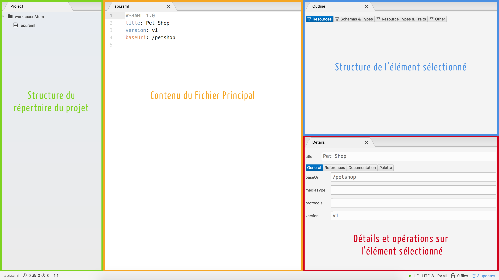

#### Ajout de Ressources et Méthodes

  * Sous l’onglet Palette de la rubrique Détails, cliquer sur *Add new ressource* pour ajouter une nouvelle ressource.
  * Appeler la ressource */pets*
  * Sélectionner les méthodes *get* et *post*

La ressource est désormais créée avec deux méthodes vides.

#### Remplir les corps et réponses des méthodes

  * Mettre le focus sur la méthode *get:*
  * Dans la Palette, cliquer sur *Create new response*
  * Garder le code 200 pour la réponse et cliquer sur OK
  * Une fois le code de la réponse généré, mettre le focus sur *200:*
  * Cliquer sur *Create new Response Body*, puis dans la fenêtre qui apparait cliquer sur OK, pour générer une réponse de type par défaut *application/json*
  * Pour la méthode post, générer directement un corps, en cliquant sur *Create new body*.

Le résultat apparaît comme suit:


#### Ajouter des sous-ressources

Pour définir le reste des méthodes (put et delete), destinées à agir sur un élément unique de la ressource pets, et les associer à une sous-ressource:

  * Mettre le focus sur */pets*
  * Cliquer sur *Add new resource*
  * Taper */{id}* comme ressource URL, et sélectionner les méthodes put et delete.
  * Ajouter un body à put de type application/json
  * Ajouter une réponse à delete de type 204

#### Définir des types
Pour définir le contenu des messages JSON manipulés, définir un type comme suit:

  * Dans une nouvelle ligne au dessus de */pets*, taper *ty*, puis cliquer sur entrée
  * Appeler le type *Pet*, puis définir les propriétés name, kind et price, comme suit:

```properties
types:
  Pet:
    properties:
      name: string
      kind: string
      price: number
```

  * Définir *Pet* comme type pour le corps de la méthode *post*, en écrivant: *type: Pet* au dessous de *application/json* de la méthode post
  * Ajouter de même *Pet* comme type pour la méthode put, et *Pet[]* pour la méthode get.

#### Extraction d’un type de ressources
Pour générer un type de ressources à partir d’une ressource existante:

  * Mettre le focus sur la ressource */pets*
  * Cliquer sur *Extract Resource Type* (si vous ne la trouvez pas, appuyer sur *entrée*)
  * Taper *Collection* comme nom de type de ressource et déplacer les méthodes get et post de la fenêtre de gauche vers celle de droite
  * Un nouveau *resourceType*, appelé *Collection*, est créé, contenant les méthodes get et post comme elles ont été définies sous la ressource */pets*. De plus, */pets* est désormais de type *Collection*.
  * Répéter la procédure pour la ressource /{id}. On appellera le type *Member*.

Le résultat devra ressembler à ce qui suit:

<center>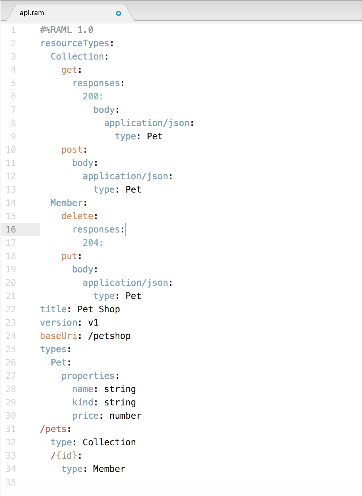</center>

#### Ajout de paramètres au type de ressource
Pour rendre le type de ressource créé générique, il serait plus intéressant de paramétrer le type de réponse. Pour cela:

  * Remplacer le terme *Pet* dans *Collection* et *Member* par ``` <<item>> ```.
  * Corriger les erreurs qui s’affichent dans les ressources *Collection* et *Member* respectivement par ```{ Collection: {item : Pet} }``` et ```{ Member: {item : Pet} }```

#### Ajout d’un exemple
Pour ajouter un exemple d’animal, modifier le type *Pet* pour qu’il soit comme suit:

```properties
types:
  Pet:
    properties:
      name: string
      kind: string
      price: number
    example:
      name: Snoopy
      kind: Dog
      price: 1000
```

#### Définir des paramètres pour les méthodes
Nous nous proposons d’ajouter une autre méthode de type *get*, qui définit plusieurs paramètres.

  * Sous (et au même niveau que) *type* de */pets*, taper: *get:*
  * Mettre le focus sur le *get* nouvellement créé
  * Cliquer sur *Create new query parameter*
  * Créer trois paramètres:
    - *priceLessThan* de type *number*
    - *priceMoreThan* de type *number*
    - *petKind*, de type *enum;[bird, dog]*

Cela devra ressembler à ce qui suit:
```properties
get:
    queryParameters:
      priceLessThan: number
      priceMoreThan: number
      petKind:
        enum:
          - bird
          - dog
```

Il est possible d’extraire certains des paramètres comme *Trait*, c’est à dire un critère de filtrage. Pour cela:

  * Mettre le focus sur le *get*
  * Cliquer sur *Extract trait*
  * Nommer le trait *FiltrableByPrice*, et déplacer les méthodes *priceLessThan* et *priceMoreThan* vers la droite.

Vous remarquerez que les deux paramètres choisis ont été enlevés de la méthode *get*, et remplacés par *is: [FilterableByPrice]*.

Voici donc le résultat final du fichier RAML:
```properties
#%RAML 1.0
traits:
  FiltrableByPrice:
    queryParameters:
      priceLessThan: number
      priceMoreThan: number
resourceTypes:
  Collection:
    get:
      responses:
        200:
          body:
            application/json:
              type: <<item>>
    post:
      body:
        application/json:
          type: <<item>>
  Member:
    delete:
      responses:
        204:
    put:
      body:
        application/json:
          type: <<item>>
title: Pet Shop
version: v1
baseUri: /petshop
types:
  Pet:
    properties:
      name: string
      kind: string
      price: number
    example:
      name: Snoopy
      kind: Dog
      price: 1000
/pets:
  type: { Collection: {item : Pet} }
  get:
    queryParameters:
      petKind:
        enum:
          - bird
          - dog
    is: [FiltrableByPrice]
  /{id}:
    type: { Member: {item : Pet} }
```

#### Extraction de la librairie
Pour extraire les types définis et les représenter dans une entité réutilisable:

  * Mettre le focus en dehors de toutes les structures, par exemple sur *title*
  * Cliquer sur *Extract Library*
  * Appeler la librarie *PetTypes*
  * Déplacer *Pet*, *Collection* et *Member* vers le panel de droite
  * Cliquer sur *Extract*

Un nouveau fichier contenant les trois types sélectionnés a été créé, puis inclus comme référence dans notre fichier principal.

### API Management avec Anypoint Studio
#### Anypoint Platform

[Anypoint](https://www.mulesoft.com/platform/enterprise-integration) est une plateforme développée par l’entreprise Mulesoft qui offre les outils nécessaires pour la gestion d’APIs. Anypoint est classée par Gartner dans son Magic Quadrant dans la rubrique “Application Services Governance” d’Avril 2015 parmi les leaders du marché du API Management.


#### Première Application
Une fois Anypoint Studio téléchargé et installé, créer un nouveau projet, qu’on appellera *PremiereApplication*, et choisir Mule Server comme *Runtime Environment*.
La fenêtre obtenue a l’allure suivante:

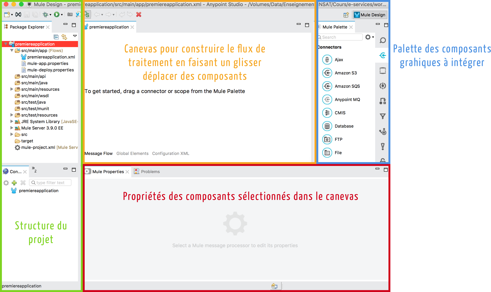

!!!warning "Attention"
    Anypoint Studio version 6.4.1 ne fonctionne qu'avec au plus JDK 1.8.0_151!

Nous allons commencer par créer une simple application qui affiche un message dans un navigateur.

  * À partir de la palette, glisser-déplacer les éléments graphiques suivants dans le canevas:
    - **HTTP**: permet de se connecter aux ressources web via HTTP ou HTTPS.
    - **Set Payload**: modifie le message affiché (payload) en "Hello World!".

Votre flux aura l’allure suivante:

<center>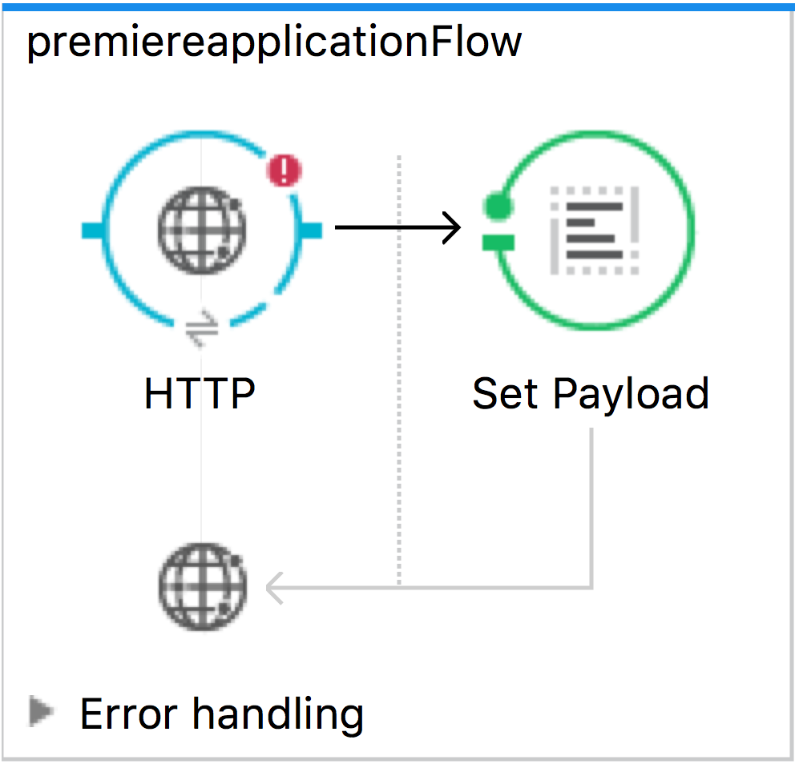</center>

Configurer votre composant HTTP :

  * Ajouter une nouvelle *Connector Configuration*
  * Garder les options par défaut. Votre hôte se lancera à l’URL 0.0.0.0:8081

Configurer le composant Set Payload:

  * Remplacer la valeur de l’élément *Value* par *Hello World!*
  * Lancer votre application : Run -> Run As -> Mule Application. La console devrait afficher un message comme suit:

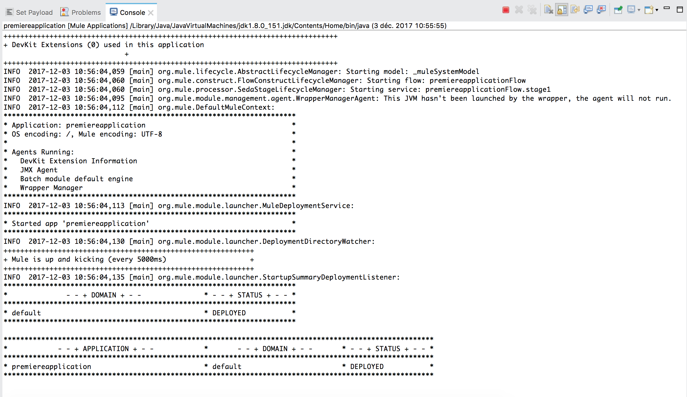

Dans un navigateur, taper l'adresse: 0.0.0.0:8081. Le message suivant devra s'afficher:

<center>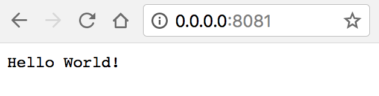</center>

#### Gestion des APIs avec APIKit
APIKit est un toolkit open source spécialement créé pour faciliter l’implémentation d’APIs REST, en renforçant les bonnes pratiques de création d’APIs.

Nous allons pour cela exposer l'API REST que nous avons créé dans le [TP précédent](tp4.md), grâce aux microservices Spring.

##### *Création d'un fichier RAML pour le microservice*
Pour représenter le microservice "ProductService", créer le fichier *api.raml* suivant avec Atom:

```properties
#%RAML 1.0
title: Micro-API
version: v1
baseUri: http://products.tn
/products:
  get:
    description: List of all the products
    responses:
      200:
        body:
          application/json:
            example: !include products-example.json

```

Rajouter également (dans le même répertoire) un fichier *products-example.json*, où vous allez trouver un exemple de produits, tel qu'ils sont représentés par votre service sur ```http://localhost:9999/product-service/products```. Cela devrait ressembler à ce qui suit:

```JSON
{
  "_embedded": {
    "products": [
      {
        "name": "Sample Product",
        "_links": {
          "self": {
            "href": "http://localhost:9999/product-service/products/1"
          },
          "product": {
            "href": "http://localhost:9999/product-service/products/1"
          }
        }
      }
    ]
  },
  "_links": {
    "self": {
      "href": "http://localhost:9999/product-service/products{?page,size,sort}",
      "templated": true
    },
    "profile": {
      "href": "http://localhost:9999/product-service/profile/products"
    },
    "search": {
      "href": "http://localhost:9999/product-service/products/search"
    }
  },
  "page": {
    "size": 20,
    "totalElements": 3,
    "totalPages": 1,
    "number": 0
  }
}


```


##### *Nouveau Projet de API Management*
Créer un nouveau projet qu’on appellera *API_Project*:

  * Choisir comme environnement d’exécution Mule Server.
  * Cocher la case *Add APIKit components* et entrer votre fichier api.raml.

Un nouveau projet sera créé avec les fichiers *api.raml* et *products-example.json* ajouté sous le répertoire *src/main/api*, ainsi que des flux de gestion des différentes méthodes ajoutées par défaut dans le canevas. Vous retrouverez notamment:

|Flux|Description|Figure|
|---------|------------------------------------------------|-------------|
| api-main | Flux principal, définissant un point d’accès HTTP, un routeur APIKit et une référence à une stratégie d'exception   | |
| action:/ressource:api-config | Un Backend flow pour chaque paire de ressource/action dans le fichier RAML. Par exemple, get:/products:api-config représente l’action get de la ressource products   | 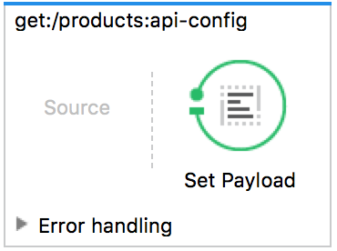|
| Exception Strategy Mapping | Flux fournis par Studio pour configurer les messages d’erreur dans un format HTTP-status-code-friendly | 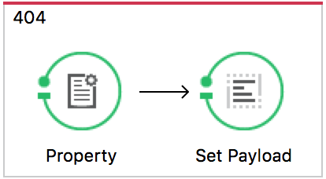 |

##### *Configuration du flux principal*

  * Dans les propriétés du composant HTTP, définir le Path par: /prod-services/*.
  * Dans le *Connector Configuration*, cliquer sur l'icône , puis cliquer sur *OK* pour valider le host (0.0.0.0) et le port (8081)

!!!note "Remarque"
    Vous pouvez changer ici le port défini par défaut, pour éviter les conflits avec vos microservices.

Lancer le projet comme *Mule Project*. Une *APIKit Console* s'affiche comme suit:

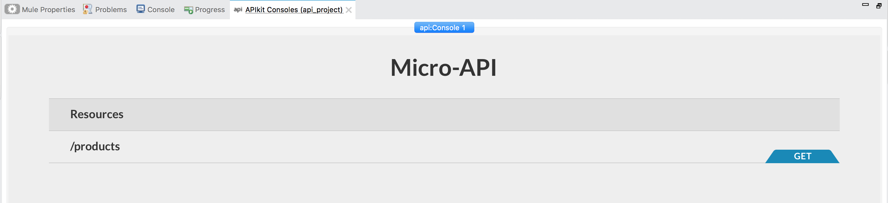

Pour tester votre API, cliquer par exemple sur le bouton *GET* devant la ressource */products*. la Console affichera alors la réponse (le produit *Sample Product*), qui a été définie comme exemple dans le fichier RAML de départ.

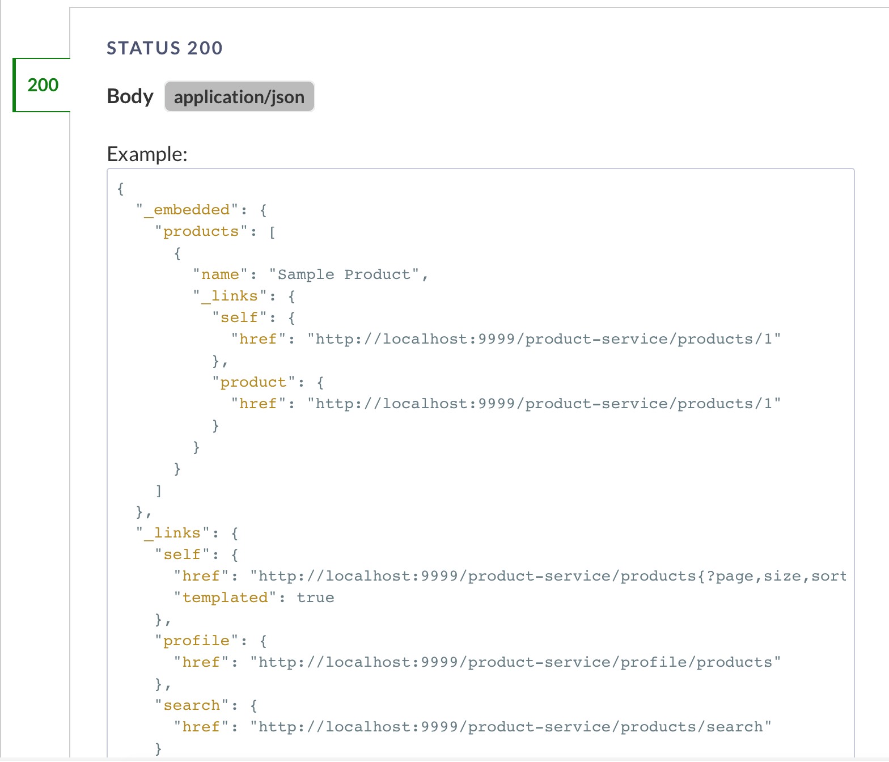

Pour visualiser le résultat sur le navigateur, taper le chemin de la requête comme suit:


```URL
http://localhost:8081/prod-services/products
```

Vous obtiendrez le résultat suivant:

<center>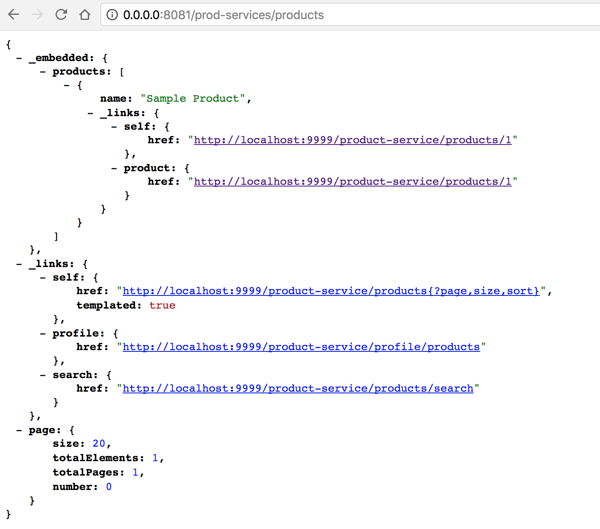</center>

#### Mapping de l'API avec votre microservice ProductService
Pour relier votre API créée avec le microservice Proxy (créé dans le TP précédent), et qui est déployé à l'adresse suivante:

```URL
http://localhost:9999/product-service/products
```

  * Supprimer le *Set Payload* du flow : _get:/products:api-config_
  * Ajouter un connecteur HTTP dans la partie *Source*
  * Le configurer comme suit:
    - Path: /prod-services
    - Cliquer sur  puis sur OK pour valider le hôte et port.
  * Ajouter un connecteur HTTP dans la partie *Process*
  * Le configurer comme suit:
    - Devant *Connector Configuration*, cliquer sur  pour ajouter une nouvelle configuration.
    - Cela représente les informations du service auquel on va accéder. Définir le Host par *localhost*, le port par *9999*, et le base path par */product-service*
    - Cliquer sur OK pour valider
  * Dans la partie *URL Settings*, définir :
    - Path: /products
    - Method: Get
  * Sauvegarder, et lancer le service.

Tester le service sur le navigateur avec l'URL:
``` http://localhost:8081/prod-services ```. Vous obtiendrez la liste complète des produits, tels que retournés par le service *ProductService* initial, comme suit:

```JSON
{
  "_embedded": {
    "products": [
      {
        "name": "Pencil",
        "_links": {
          "self": {
            "href": "http://localhost:9999/product-service/products/1"
          },
          "product": {
            "href": "http://localhost:9999/product-service/products/1"
          }
        }
      },
      {
        "name": "Book",
        "_links": {
          "self": {
            "href": "http://localhost:9999/product-service/products/2"
          },
          "product": {
            "href": "http://localhost:9999/product-service/products/2"
          }
        }
      },
      {
        "name": "Eraser",
        "_links": {
          "self": {
            "href": "http://localhost:9999/product-service/products/3"
          },
          "product": {
            "href": "http://localhost:9999/product-service/products/3"
          }
        }
      }
    ]
  },
  "_links": {
    "self": {
      "href": "http://localhost:9999/product-service/products{?page,size,sort}",
      "templated": true
    },
    "profile": {
      "href": "http://localhost:9999/product-service/profile/products"
    },
    "search": {
      "href": "http://localhost:9999/product-service/products/search"
    }
  },
  "page": {
    "size": 20,
    "totalElements": 3,
    "totalPages": 1,
    "number": 0
  }
}


```

#### Transformation du résultat du microservice ProductService
Si vous désirez retourner un résultat différent du Microservice initial, en ne laissant par exemple que les noms des produits, sans tous les autres éléments et liens supplémentaires, utiliser un objet *Transform Message*

  * Copier le flow get:/products pour créer un autre flow identique
  * Modifier le Path du connecteur HTTP source, pour  */prod-services/names*
  * Rajouter un objet *Transform Message* juste après le connecteur HTTP de droite (celui de la partie Process). Le flow devra ressembler à ce qui suit:

<center>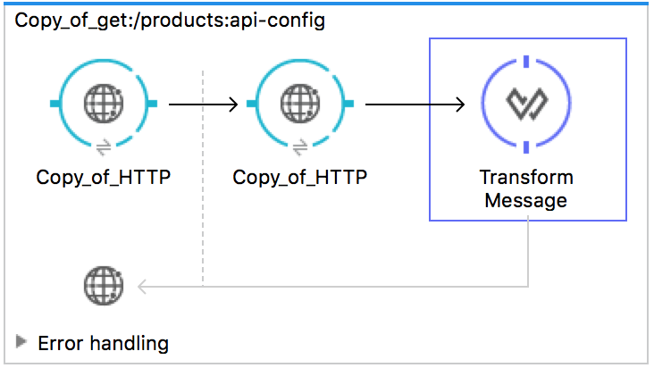</center>

  * Configurer l'objet *Transform Message*:
    - L'interface suivante représente les mappings à faire entre les entrées du service et sa sortie.

    <center>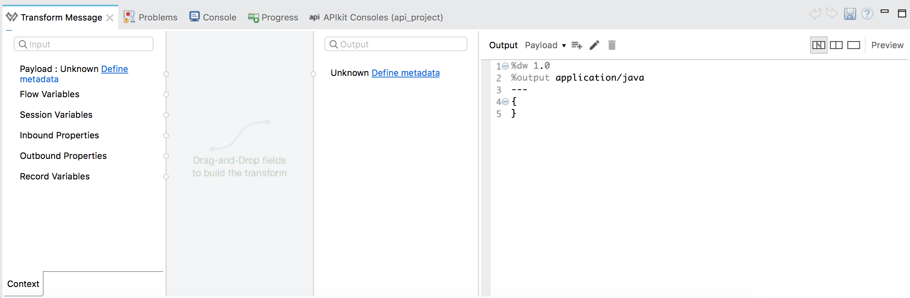</center>

    - Cliquer sur *Define Metadata* du payload en entrée (à gauche) gauche)
    - Cliquer sur *Add*
    - Entrer le nom du type en entrée, par exemple *products*
    - Indiquer comme type *JSON*
    - Indiquer dans la liste déroulante suivante que le fichier donné est un *Example*, puis choisir le fichier *products-example.json* que vous aviez créé.
    - Cliquer sur Select. Le schéma du fichier donné est chargé dans la partie *Input* de *Transform Message*.
    - Pour représenter le format de sortie désiré, créer un fichier appelé *names.json* à l'endroit de votre préférence sur votre ordinateur.
    - Saisir le contenu suivant dans *names.json*:
    ```json
      {"name":"prod"}
    ```
    - Cliquer sur *Define Metadata* de sortie (à droite).
    - Ajouter un nouveau type que vous appellerez *names*
    - Définir comme type *Json* et charger le fichier *names.json* que vous venez de créer.
    - Valider.
    - Maintenant que les deux schémas (entrée et sortie) sont définis, créer les associations de votre choix. Dans notre cas, nous allons associer le champ *_embedded.products.name* en entrée au champ *name* en sortie, comme suit:
    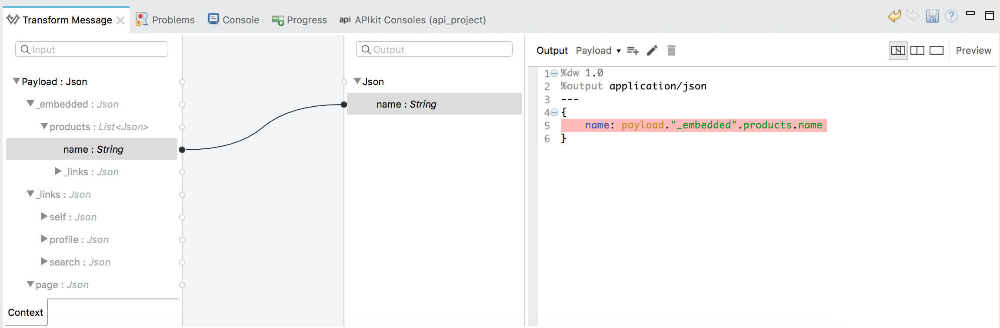
    - Sauvegarder, et lancer le service.

Pour tester le service, lancer dans un navigateur: ```http://localhost:8081/prod-services/names```. Vous obtiendrez le résultat suivant:

```JSON
{
  "name": [
    "Pencil",
    "Book",
    "Eraser"
  ]
}
```
